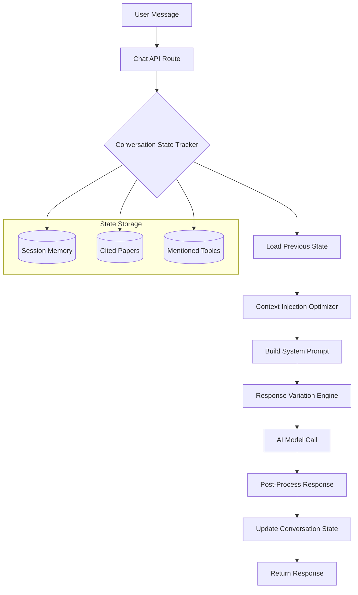

# Design Document: AI Conversation Memory & Response Variation

## Overview

本设计解决 AI 助手在同一对话中重复回复的问题，通过引入对话状态追踪、响应变化策略和上下文去重机制，让 AI 表现得像一位记忆力超强的顶级医生朋友。

核心改进点：
1. **Conversation State Tracker** - 追踪对话中已提及的内容
2. **Response Variation Engine** - 动态调整回复格式和语气
3. **Citation Deduplication** - 论文引用去重
4. **Context Injection Optimizer** - 智能注入上下文，避免重复

## Architecture



## Components and Interfaces

### 1. ConversationStateTracker

追踪单次对话的状态，存储在内存中（基于 session）。

```typescript
interface ConversationState {
  turnCount: number;                    // 对话轮次
  mentionedHealthContext: boolean;      // 是否已提及健康上下文
  citedPaperIds: Set<string>;          // 已引用的论文 ID
  usedFormats: string[];               // 已使用的回复格式
  usedEndearments: string[];           // 已使用的称呼语
  lastResponseStructure: ResponseStructure; // 上次回复结构
  establishedContext: string[];        // 已建立的上下文要点
}

interface ResponseStructure {
  hasKeyTakeaway: boolean;
  hasEvidence: boolean;
  hasActionAdvice: boolean;
  hasBulletPoints: boolean;
  hasNumberedList: boolean;
}
```

### 2. ResponseVariationEngine

根据对话状态动态调整回复策略。

```typescript
interface VariationStrategy {
  formatStyle: 'structured' | 'conversational' | 'concise' | 'detailed';
  endearmentPool: string[];
  citationStyle: 'formal' | 'casual' | 'minimal';
  shouldMentionHealthContext: boolean;
}

function selectVariationStrategy(state: ConversationState): VariationStrategy;
```

### 3. ContextInjectionOptimizer

智能决定哪些上下文需要注入到 system prompt。

```typescript
interface ContextInjectionDecision {
  includeFullHealthContext: boolean;   // 是否包含完整健康上下文
  includeHealthReminder: boolean;      // 是否包含简短健康提醒
  excludePaperIds: string[];           // 排除的论文 ID
  contextSummary: string;              // 精简的上下文摘要
}

function optimizeContextInjection(
  state: ConversationState,
  userProfile: UserProfile,
  scientificPapers: Paper[]
): ContextInjectionDecision;
```

### 4. PersonaPromptBuilder

构建顶级医生+风趣朋友的人设提示。

```typescript
interface PersonaConfig {
  expertise: 'harvard_mayo_level';
  tone: 'witty_friendly';
  memoryEmphasis: 'exceptional';
  responseStyle: 'confident_thorough_personable';
}

function buildPersonaPrompt(config: PersonaConfig, turnCount: number): string;
```

## Data Models

### ConversationSession (In-Memory)

```typescript
// 存储在 API 请求的 messages 数组中作为隐式状态
// 或通过前端传递 sessionState 对象

interface SessionState {
  id: string;
  startedAt: Date;
  state: ConversationState;
}
```

### Response Metadata

```typescript
interface ResponseMetadata {
  turnNumber: number;
  formatUsed: string;
  papersNewlyCited: string[];
  healthContextMentioned: boolean;
}
```

## Correctness Properties

*A property is a characteristic or behavior that should hold true across all valid executions of a system-essentially, a formal statement about what the system should do. Properties serve as the bridge between human-readable specifications and machine-verifiable correctness guarantees.*

### Property 1: Health Context Non-Repetition
*For any* conversation with N turns (N > 1) where health context exists, the full health condition statement (e.g., "考虑到你目前有【眼睑板又开口...】") SHALL appear at most once in the conversation.
**Validates: Requirements 1.1**

### Property 2: Response Format Variation
*For any* conversation with N turns (N >= 3), not all responses SHALL have identical structure markers (关键要点/科学证据/行动建议 all present).
**Validates: Requirements 2.1, 2.2**

### Property 3: Follow-up Response Conciseness
*For any* follow-up question (turn > 1), the response length SHALL be shorter than the initial response when the question is simpler.
**Validates: Requirements 2.3, 5.2**

### Property 4: Language Expression Variation
*For any* conversation with N turns (N >= 3), the same term of endearment (e.g., "宝子") SHALL NOT appear in every response.
**Validates: Requirements 3.1, 3.2, 3.3**

### Property 5: Citation Deduplication
*For any* conversation where scientific papers are cited, the same paper (by title or ID) SHALL NOT be cited with full reference more than once.
**Validates: Requirements 4.1, 4.2**

### Property 6: Direct Plan Response
*For any* user request containing plan/方案/建议 keywords after context is established, the response SHALL NOT contain a full restatement of the user's health condition.
**Validates: Requirements 5.1**

### Property 7: User Detail Memory
*For any* detail shared by the user in the conversation, subsequent AI responses SHALL have access to that detail in context (verifiable through state tracking).
**Validates: Requirements 6.4**

## Error Handling

| Error Scenario | Handling Strategy |
|----------------|-------------------|
| State tracking fails | Fall back to stateless mode, log warning |
| Paper deduplication fails | Allow duplicate, log for review |
| Format variation exhausted | Cycle back to first format with slight variation |
| Memory overflow (long conversation) | Summarize older context, keep recent N turns |

## Testing Strategy

### Unit Tests
- Test `ConversationStateTracker` state updates
- Test `ResponseVariationEngine` strategy selection
- Test `ContextInjectionOptimizer` decision logic
- Test `PersonaPromptBuilder` output format

### Property-Based Tests

使用 **fast-check** 库进行属性测试。

每个属性测试必须：
1. 使用注释标注对应的 correctness property
2. 运行至少 100 次迭代
3. 生成随机但有效的对话场景

```typescript
// Example test annotation format:
// **Feature: ai-conversation-memory, Property 1: Health Context Non-Repetition**
// **Validates: Requirements 1.1**
```

### Integration Tests
- End-to-end conversation flow with state tracking
- Multi-turn conversation simulation
- Citation deduplication across turns
