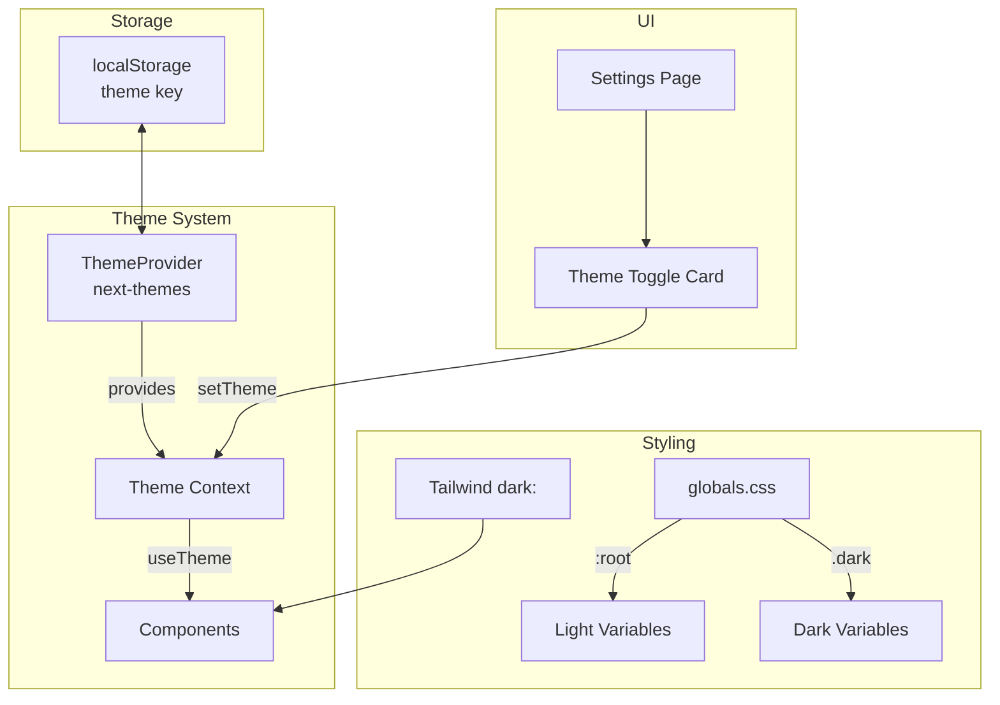

# Design Document: Dark Theme Toggle

## Overview

本设计为 No More Anxious 应用实现暗色主题切换功能。基于现有的 `next-themes` 基础设施，添加「极简黑」(Minimal Dark) 主题，使用纯黑渐变背景配合微妙光晕效果。用户可在设置页面的「外观」区域切换主题。

**关键约束**: 由于系统深色模式会影响 CSS 变量导致文字不可读，系统强制使用浅色主题作为默认，禁用系统偏好跟随功能 (`enableSystem={false}`)。

## Architecture



## Components and Interfaces

### 1. ThemeProvider (已存在，需微调)

```typescript
// components/ThemeProvider.tsx
interface ThemeProviderConfig {
  attribute: 'class';           // 使用 class 切换
  defaultTheme: 'light';        // 默认浅色
  enableSystem: false;          // 禁用系统跟随
  disableTransitionOnChange: false; // 启用过渡动画
  storageKey: 'nma-theme';      // localStorage key
}
```

### 2. ThemeToggleCard (设置页面组件)

```typescript
interface ThemeToggleCardProps {
  className?: string;
}

interface ThemeOption {
  value: 'light' | 'dark';
  label: string;
  icon: React.ReactNode;
  description: string;
}
```

### 3. useTheme Hook (来自 next-themes)

```typescript
interface UseThemeReturn {
  theme: string | undefined;        // 当前主题
  setTheme: (theme: string) => void; // 设置主题
  resolvedTheme: string | undefined; // 解析后的主题
  themes: string[];                  // 可用主题列表
}
```

## Data Models

### CSS Variables Structure

```css
/* Light Theme (燕麦绿) - :root */
{
  --background: 39 47% 96%;      /* #FAF6EF */
  --foreground: 0 0% 9%;         /* #171717 */
  --card: 0 0% 100%;             /* White */
  --primary: 161 78% 14%;        /* #0B3D2E */
  --accent: 38 92% 50%;          /* #F59E0B */
}

/* Dark Theme (极简黑) - .dark */
{
  --background: 0 0% 4%;         /* #0a0a0a */
  --foreground: 0 0% 96%;        /* #f5f5f5 */
  --card: 0 0% 7%;               /* #121212 */
  --primary: 161 78% 30%;        /* Lighter green */
  --accent: 38 92% 55%;          /* Brighter amber */
}
```

### Theme Persistence

```typescript
// localStorage structure
{
  key: 'nma-theme',
  value: 'light' | 'dark'
}
```

## Correctness Properties

*A property is a characteristic or behavior that should hold true across all valid executions of a system-essentially, a formal statement about what the system should do. Properties serve as the bridge between human-readable specifications and machine-verifiable correctness guarantees.*

### Property 1: Theme Persistence Round-Trip

*For any* theme selection (light or dark), if a user selects that theme, the value should be persisted to localStorage, and upon app reload, the same theme should be restored.

**Validates: Requirements 1.3, 1.4**

### Property 2: Immediate Theme Application

*For any* theme change via setTheme, the document's root element should immediately reflect the new theme class without page reload.

**Validates: Requirements 1.2**

### Property 3: Dark Mode Contrast Compliance

*For any* text element in dark mode, the contrast ratio between foreground and background colors should meet WCAG AA standards (minimum 4.5:1 for normal text, 3:1 for large text).

**Validates: Requirements 2.5, 5.1, 5.2, 5.3**

### Property 4: useTheme Hook Contract

*For any* component using the useTheme hook, the hook should return an object containing theme (current theme string), setTheme (function), and resolvedTheme (resolved theme string).

**Validates: Requirements 3.2**

### Property 5: Selected State Indicator

*For any* theme option in the toggle UI, when that theme is active, the option should have a visually distinct selected state (e.g., ring, border, or background highlight).

**Validates: Requirements 6.3**

## Error Handling

| Scenario | Handling |
|----------|----------|
| localStorage unavailable | 使用内存存储，默认 light 主题 |
| Invalid theme value in storage | 重置为 'light' |
| CSS 变量未定义 | 使用 fallback 值 |
| Hydration mismatch | 使用 `suppressHydrationWarning` |

## Testing Strategy

### Unit Tests

- ThemeToggleCard 渲染测试
- 主题选项点击事件测试
- 选中状态样式测试

### Property-Based Tests

使用 **fast-check** 作为 property-based testing 库。

每个 property-based test 必须：
1. 运行至少 100 次迭代
2. 使用注释标注对应的 correctness property
3. 格式: `**Feature: dark-theme-toggle, Property {number}: {property_text}**`

**测试覆盖:**

1. **Property 1 测试**: 生成随机主题序列，验证每次设置后 localStorage 值正确，模拟 reload 后主题恢复
2. **Property 2 测试**: 生成随机主题切换序列，验证每次切换后 document.documentElement.classList 立即更新
3. **Property 3 测试**: 生成随机 CSS 变量组合，计算对比度，验证符合 WCAG AA
4. **Property 4 测试**: 在不同主题状态下调用 useTheme，验证返回值结构一致
5. **Property 5 测试**: 生成随机主题选择，验证对应选项有 selected 样式类

### Integration Tests

- 设置页面主题切换端到端流程
- 跨页面主题一致性验证
