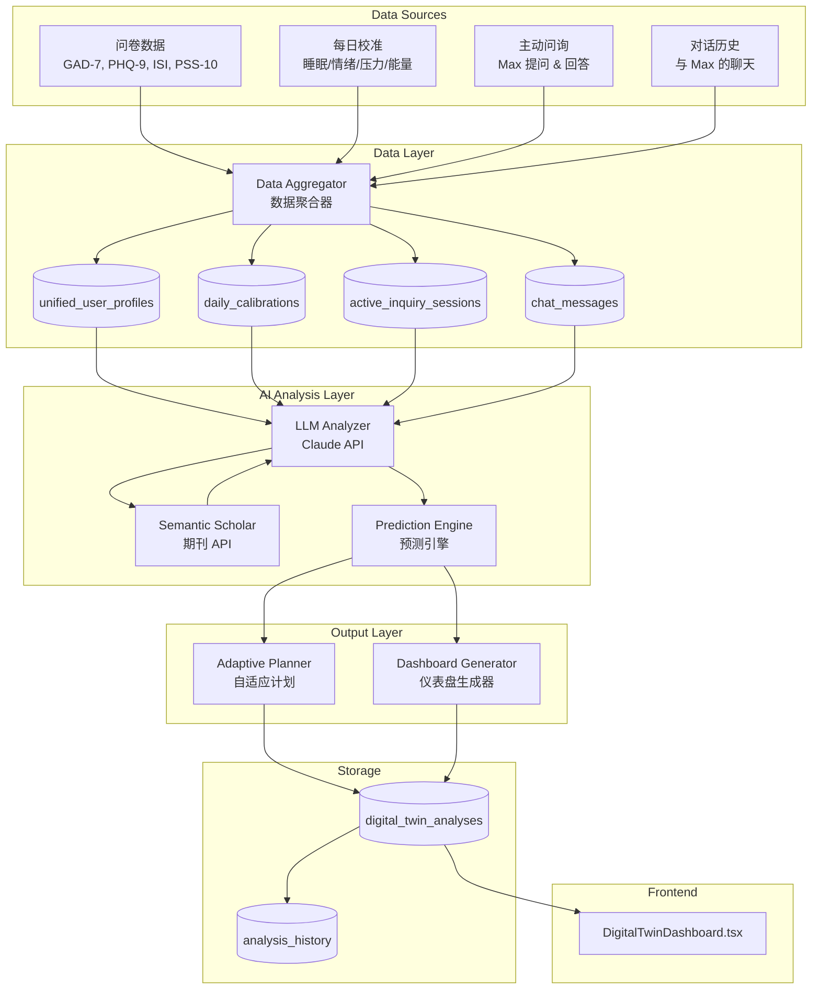

# Design Document: Digital Twin AI Analytics

## Overview

数字孪生 AI 分析系统是一个智能健康分析引擎，通过整合用户的多维度数据（问卷、每日校准、Max 对话、主动问询），调用大语言模型和 Semantic Scholar 期刊 API，生成：

1. **生理状态评测** - 基于科学文献的健康状态分析
2. **自适应计划** - 个性化的干预和改善建议  
3. **仪表盘数据** - 动态更新的可视化指标和预测

系统遵循 Project Constitution 中的核心理念：用生理真相替代焦虑，提供科学依据支持的健康洞察。

## Architecture



## Components and Interfaces

### 1. Data Aggregator (`lib/digital-twin/data-aggregator.ts`)

```typescript
interface AggregatedUserData {
  userId: string;
  
  // 问卷基线数据
  baseline: {
    gad7Score: number;
    phq9Score: number;
    isiScore: number;
    pss10Score: number;
    assessmentDate: string;
    interpretations: Record<string, string>;
  } | null;
  
  // 每日校准时间序列
  calibrations: Array<{
    date: string;
    sleepHours: number;
    sleepQuality: number;
    moodScore: number;
    stressLevel: number;
    energyLevel: number;
  }>;
  
  // 主动问询数据
  inquiryInsights: Array<{
    date: string;
    topic: string;
    userResponse: string;
    extractedIndicators: Record<string, unknown>;
  }>;
  
  // 对话分析摘要
  conversationSummary: {
    totalMessages: number;
    emotionalTrend: 'improving' | 'stable' | 'declining';
    frequentTopics: string[];
    lastInteraction: string;
  };
  
  // 用户画像
  profile: {
    age?: number;
    gender?: string;
    primaryConcern?: string;
    registrationDate: string;
  };
}

async function aggregateUserData(userId: string): Promise<AggregatedUserData>;
async function getCalibrationTrend(userId: string, days: number): Promise<TrendData>;
async function extractConversationInsights(userId: string): Promise<ConversationInsights>;
```

### 2. LLM Analyzer (`lib/digital-twin/llm-analyzer.ts`)

```typescript
interface AnalysisPromptContext {
  userData: AggregatedUserData;
  papers: Paper[];  // From Semantic Scholar
  previousAnalysis?: DigitalTwinAnalysis;
}

interface PhysiologicalAssessment {
  overallStatus: 'improving' | 'stable' | 'needs_attention';
  anxietyLevel: { score: number; trend: string; confidence: number };
  sleepHealth: { score: number; trend: string; confidence: number };
  stressResilience: { score: number; trend: string; confidence: number };
  moodStability: { score: number; trend: string; confidence: number };
  energyLevel: { score: number; trend: string; confidence: number };
  hrvEstimate: { score: number; trend: string; confidence: number };
  riskFactors: string[];
  strengths: string[];
  scientificBasis: Array<{
    claim: string;
    paperTitle: string;
    paperUrl: string;
    citationCount: number;
  }>;
}

interface LLMAnalysisResult {
  assessment: PhysiologicalAssessment;
  predictions: LongitudinalPredictions;
  adaptivePlan: AdaptivePlan;
  analysisTimestamp: string;
  modelUsed: string;
  confidenceScore: number;
}

async function analyzeWithLLM(context: AnalysisPromptContext): Promise<LLMAnalysisResult>;
function buildAnalysisPrompt(context: AnalysisPromptContext): string;
function parseAnalysisResponse(response: string): LLMAnalysisResult;
```

### 3. Prediction Engine (`lib/digital-twin/prediction-engine.ts`)

```typescript
interface LongitudinalPredictions {
  timepoints: Array<{
    week: number;  // 0, 3, 6, 9, 12, 15
    predictions: {
      anxietyScore: { value: number; confidence: string };  // e.g., "3.8 ± 0.9"
      sleepQuality: { value: number; confidence: string };
      stressResilience: { value: number; confidence: string };
      moodStability: { value: number; confidence: string };
      energyLevel: { value: number; confidence: string };
      hrvScore: { value: number; confidence: string };
    };
  }>;
  
  baselineComparison: {
    metric: string;
    baseline: number;
    current: number;
    change: number;
    changePercent: number;
  }[];
}

interface TreatmentMilestone {
  week: number;
  event: string;
  status: 'completed' | 'current' | 'upcoming';
  detail: string;
  actualScore?: number;
}

async function generatePredictions(
  assessment: PhysiologicalAssessment,
  calibrationHistory: CalibrationData[]
): Promise<LongitudinalPredictions>;

function calculateMilestones(
  registrationDate: string,
  calibrationHistory: CalibrationData[]
): TreatmentMilestone[];
```

### 4. Adaptive Planner (`lib/digital-twin/adaptive-planner.ts`)

```typescript
interface AdaptivePlan {
  dailyFocus: Array<{
    area: string;
    priority: 'high' | 'medium' | 'low';
    action: string;
    rationale: string;
    scientificBasis?: string;
  }>;
  
  breathingExercises: Array<{
    name: string;
    duration: string;
    timing: string;
    benefit: string;
  }>;
  
  sleepRecommendations: Array<{
    recommendation: string;
    reason: string;
    expectedImpact: string;
  }>;
  
  activitySuggestions: Array<{
    activity: string;
    frequency: string;
    duration: string;
    benefit: string;
  }>;
  
  avoidanceBehaviors: string[];
  
  nextCheckpoint: {
    date: string;
    focus: string;
  };
}

async function generateAdaptivePlan(
  assessment: PhysiologicalAssessment,
  papers: Paper[],
  userPreferences?: UserPreferences
): Promise<AdaptivePlan>;
```

### 5. Dashboard Generator (`lib/digital-twin/dashboard-generator.ts`)

```typescript
interface DashboardData {
  // 参与者信息
  participant: {
    initials: string;
    age?: number;
    gender?: string;
    diagnosis: string;
    registrationDate: string;
  };
  
  // 预测表格数据
  predictionTable: {
    metrics: Array<{
      name: string;
      baseline: number;
      predictions: Record<string, string>;  // week -> "value ± confidence"
    }>;
  };
  
  // 时间线数据
  timeline: TreatmentMilestone[];
  
  // 基线数据
  baselineData: {
    assessments: Array<{
      name: string;
      value: string;
      interpretation: string;
    }>;
    vitals: Array<{
      name: string;
      value: string;
      trend: string;
    }>;
  };
  
  // 图表数据
  charts: {
    anxietyTrend: number[];
    sleepTrend: number[];
    hrvTrend: number[];
    energyTrend: number[];
  };
  
  // 汇总统计
  summaryStats: {
    overallImprovement: string;
    daysToFirstResult: number;
    consistencyScore: string;
  };
  
  // 元数据
  lastAnalyzed: string;
  nextAnalysisScheduled: string;
}

async function generateDashboardData(
  analysis: LLMAnalysisResult,
  userData: AggregatedUserData
): Promise<DashboardData>;
```

### 6. API Routes

#### `/api/digital-twin/analyze` (POST)
触发完整的 AI 分析流程。

```typescript
// Request
interface AnalyzeRequest {
  userId: string;
  forceRefresh?: boolean;  // 强制重新分析
}

// Response
interface AnalyzeResponse {
  success: boolean;
  analysisId: string;
  dashboardData: DashboardData;
  adaptivePlan: AdaptivePlan;
  lastAnalyzed: string;
}
```

#### `/api/digital-twin/dashboard` (GET)
获取用户的仪表盘数据。

```typescript
// Query params: userId
// Response
interface DashboardResponse {
  dashboardData: DashboardData;
  adaptivePlan: AdaptivePlan;
  isStale: boolean;  // 数据是否过期需要刷新
  lastAnalyzed: string;
}
```

## Data Models

### Database Schema

```sql
-- 数字孪生分析结果表
CREATE TABLE IF NOT EXISTS digital_twin_analyses (
  id UUID PRIMARY KEY DEFAULT gen_random_uuid(),
  user_id UUID REFERENCES auth.users(id) ON DELETE CASCADE,
  
  -- 分析输入快照
  input_snapshot JSONB NOT NULL,  -- AggregatedUserData
  
  -- AI 分析结果
  physiological_assessment JSONB NOT NULL,
  longitudinal_predictions JSONB NOT NULL,
  adaptive_plan JSONB NOT NULL,
  
  -- 科学依据
  papers_used JSONB DEFAULT '[]'::jsonb,
  
  -- 仪表盘数据（预计算）
  dashboard_data JSONB NOT NULL,
  
  -- 元数据
  model_used TEXT NOT NULL,
  confidence_score DECIMAL(3,2),
  analysis_version INTEGER DEFAULT 1,
  
  -- 时间戳
  created_at TIMESTAMPTZ DEFAULT NOW(),
  expires_at TIMESTAMPTZ DEFAULT NOW() + INTERVAL '6 hours'
);

-- 索引
CREATE INDEX idx_dta_user_id ON digital_twin_analyses(user_id);
CREATE INDEX idx_dta_created_at ON digital_twin_analyses(user_id, created_at DESC);

-- RLS
ALTER TABLE digital_twin_analyses ENABLE ROW LEVEL SECURITY;

CREATE POLICY "Users can view own analyses"
  ON digital_twin_analyses FOR SELECT
  USING (auth.uid() = user_id);

CREATE POLICY "Service role can manage all"
  ON digital_twin_analyses FOR ALL
  USING (auth.role() = 'service_role');

-- 分析历史表（长期存储）
CREATE TABLE IF NOT EXISTS analysis_history (
  id UUID PRIMARY KEY DEFAULT gen_random_uuid(),
  user_id UUID REFERENCES auth.users(id) ON DELETE CASCADE,
  analysis_id UUID REFERENCES digital_twin_analyses(id),
  
  -- 关键指标快照
  anxiety_score DECIMAL(3,1),
  sleep_quality DECIMAL(3,1),
  stress_resilience DECIMAL(3,1),
  mood_stability DECIMAL(3,1),
  energy_level DECIMAL(3,1),
  hrv_estimate DECIMAL(3,1),
  
  overall_status TEXT,
  confidence_score DECIMAL(3,2),
  
  created_at TIMESTAMPTZ DEFAULT NOW()
);

CREATE INDEX idx_ah_user_date ON analysis_history(user_id, created_at DESC);

ALTER TABLE analysis_history ENABLE ROW LEVEL SECURITY;

CREATE POLICY "Users can view own history"
  ON analysis_history FOR SELECT
  USING (auth.uid() = user_id);
```

### TypeScript Types

```typescript
// types/digital-twin.ts

export interface DigitalTwinAnalysis {
  id: string;
  userId: string;
  inputSnapshot: AggregatedUserData;
  physiologicalAssessment: PhysiologicalAssessment;
  longitudinalPredictions: LongitudinalPredictions;
  adaptivePlan: AdaptivePlan;
  papersUsed: Paper[];
  dashboardData: DashboardData;
  modelUsed: string;
  confidenceScore: number;
  analysisVersion: number;
  createdAt: string;
  expiresAt: string;
}

export interface AnalysisHistoryEntry {
  id: string;
  userId: string;
  analysisId: string;
  anxietyScore: number;
  sleepQuality: number;
  stressResilience: number;
  moodStability: number;
  energyLevel: number;
  hrvEstimate: number;
  overallStatus: string;
  confidenceScore: number;
  createdAt: string;
}
```


## Correctness Properties

*A property is a characteristic or behavior that should hold true across all valid executions of a system-essentially, a formal statement about what the system should do. Properties serve as the bridge between human-readable specifications and machine-verifiable correctness guarantees.*

### Property 1: Baseline Data Storage Round-Trip
*For any* valid questionnaire response (GAD-7, PHQ-9, ISI, PSS-10 scores), storing the baseline data and then retrieving it SHALL return the exact same scores.
**Validates: Requirements 1.1**

### Property 2: Calibration Data Append Invariant
*For any* user with N existing calibrations, adding a new calibration SHALL result in exactly N+1 calibrations, with the new entry having the most recent timestamp.
**Validates: Requirements 1.2**

### Property 3: Timeline Ordering
*For any* aggregated user data, all data points in the unified timeline SHALL be ordered by timestamp in ascending order, with no duplicate timestamps for the same data type.
**Validates: Requirements 1.5**

### Property 4: Analysis Threshold Enforcement
*For any* user, the AI_Analyzer SHALL generate predictions if and only if the user has baseline data AND at least 3 daily calibrations. Users with insufficient data SHALL receive a "collecting data" state.
**Validates: Requirements 2.1, 2.6**

### Property 5: Prediction Confidence Intervals
*For any* prediction generated by the AI_Analyzer, all metric values SHALL include a confidence interval in the format "value ± uncertainty" (e.g., "3.8 ± 0.9").
**Validates: Requirements 2.5**

### Property 6: Prediction Timepoint Completeness
*For any* longitudinal prediction output, the predictions SHALL contain exactly 6 timepoints: baseline (week 0), week 3, week 6, week 9, week 12, and week 15.
**Validates: Requirements 3.1**

### Property 7: Metric Completeness
*For any* prediction output, all 6 required metrics SHALL be present: Anxiety Score, Sleep Quality, Stress Resilience, Mood Stability, Energy Level, and HRV Score.
**Validates: Requirements 3.3**

### Property 8: Baseline Display Completeness
*For any* dashboard data, the baseline section SHALL include all 4 clinical assessment scores (GAD-7, PHQ-9, ISI, PSS-10) with their interpretations and trend indicators.
**Validates: Requirements 3.2, 5.1, 5.2, 5.4**

### Property 9: Timeline Milestone Consistency
*For any* user with a registration date, the timeline SHALL contain milestones at weeks 0, 3, 6, 9, 12, and 15, with exactly one milestone marked as "current", all earlier milestones marked as "completed", and all later milestones marked as "upcoming".
**Validates: Requirements 4.1, 4.2, 4.3, 4.5**

### Property 10: Summary Statistics Presence
*For any* dashboard data, the summary statistics SHALL include: Overall Improvement percentage, Days to First Result, and Consistency Score.
**Validates: Requirements 6.2, 6.4**

### Property 11: Participant Metadata Completeness
*For any* dashboard data, the participant section SHALL include initials (derived from name), and optionally age, gender, and primary diagnosis when available.
**Validates: Requirements 7.3, 8.1, 8.2, 8.3**

### Property 12: Medical History Privacy
*For any* dashboard data output, sensitive medical history SHALL NOT be included unless the user has explicitly granted consent (consent flag is true).
**Validates: Requirements 8.4**

### Property 13: Data Isolation (RLS)
*For any* authenticated user querying digital twin data, the returned analyses SHALL contain only records where user_id matches the authenticated user's ID.
**Validates: Requirements 9.1, 9.2**

### Property 14: Prompt Confidentiality
*For any* API response from the digital twin endpoints, the response SHALL NOT contain raw LLM prompts, internal calculation details, or debug information.
**Validates: Requirements 9.3**

## Error Handling

### Data Aggregation Errors
- Missing baseline data: Return "collecting data" state with progress indicator showing "Complete onboarding questionnaire"
- Insufficient calibrations: Return "collecting data" state with progress showing "X/3 daily calibrations completed"
- Database connection failure: Retry with exponential backoff, show "Reconnecting to your data..." toast

### LLM Analysis Errors
- API timeout: Retry up to 3 times with 2s, 4s, 8s delays
- Rate limit exceeded: Queue analysis for later, return cached data with "Analysis pending" indicator
- Invalid response format: Log error, return previous valid analysis with "Using recent analysis" indicator
- Model unavailable: Fall back to secondary model (Claude Haiku), then to rule-based analysis

### Semantic Scholar Errors
- API unavailable: Use cached papers from evidence_cache table
- No relevant papers found: Proceed without scientific citations, add disclaimer "Scientific references temporarily unavailable"
- Rate limit: Use cached results, queue refresh for later

### Dashboard Generation Errors
- Missing required fields: Use default values with "Estimated" label
- Calculation errors: Log and skip affected metric, show "Data unavailable" for that metric

## Testing Strategy

### Property-Based Testing Library
使用 **fast-check** 作为 TypeScript 的属性测试库。

### Unit Tests
- Data aggregator: Test with various data combinations (empty, partial, complete)
- Prediction engine: Test timepoint generation and metric calculations
- Dashboard generator: Test output structure and field presence
- API routes: Test authentication, error handling, response format

### Property-Based Tests
每个正确性属性都将实现为一个属性测试：

1. **Property 1 Test**: Generate random valid questionnaire scores, store and retrieve, verify equality
2. **Property 2 Test**: Generate random calibration sequences, add entries, verify count invariant
3. **Property 3 Test**: Generate random data points with timestamps, verify ordering
4. **Property 4 Test**: Generate users with varying data amounts, verify threshold behavior
5. **Property 5 Test**: Generate prediction outputs, verify confidence interval format
6. **Property 6 Test**: Generate predictions, verify exactly 6 timepoints present
7. **Property 7 Test**: Generate predictions, verify all 6 metrics present
8. **Property 8 Test**: Generate dashboard data, verify baseline completeness
9. **Property 9 Test**: Generate timelines with various registration dates, verify milestone consistency
10. **Property 10 Test**: Generate dashboard data, verify summary statistics presence
11. **Property 11 Test**: Generate participant data, verify metadata completeness
12. **Property 12 Test**: Generate dashboard data with/without consent, verify medical history exclusion
13. **Property 13 Test**: Simulate multi-user queries, verify data isolation
14. **Property 14 Test**: Generate API responses, verify no prompt leakage

### Test Configuration
- 每个属性测试运行最少 100 次迭代
- 使用 `fc.configureGlobal({ numRuns: 100 })` 配置 fast-check
- 测试文件命名: `*.property.test.ts`

### Test Annotation Format
每个属性测试必须包含注释：
```typescript
/**
 * **Feature: digital-twin-analytics, Property N: Property Title**
 * **Validates: Requirements X.Y**
 */
```

### Integration Tests
- End-to-end analysis flow: Questionnaire → Calibrations → Analysis → Dashboard
- Real LLM integration (with mocked Semantic Scholar)
- Database RLS verification with multiple test users
