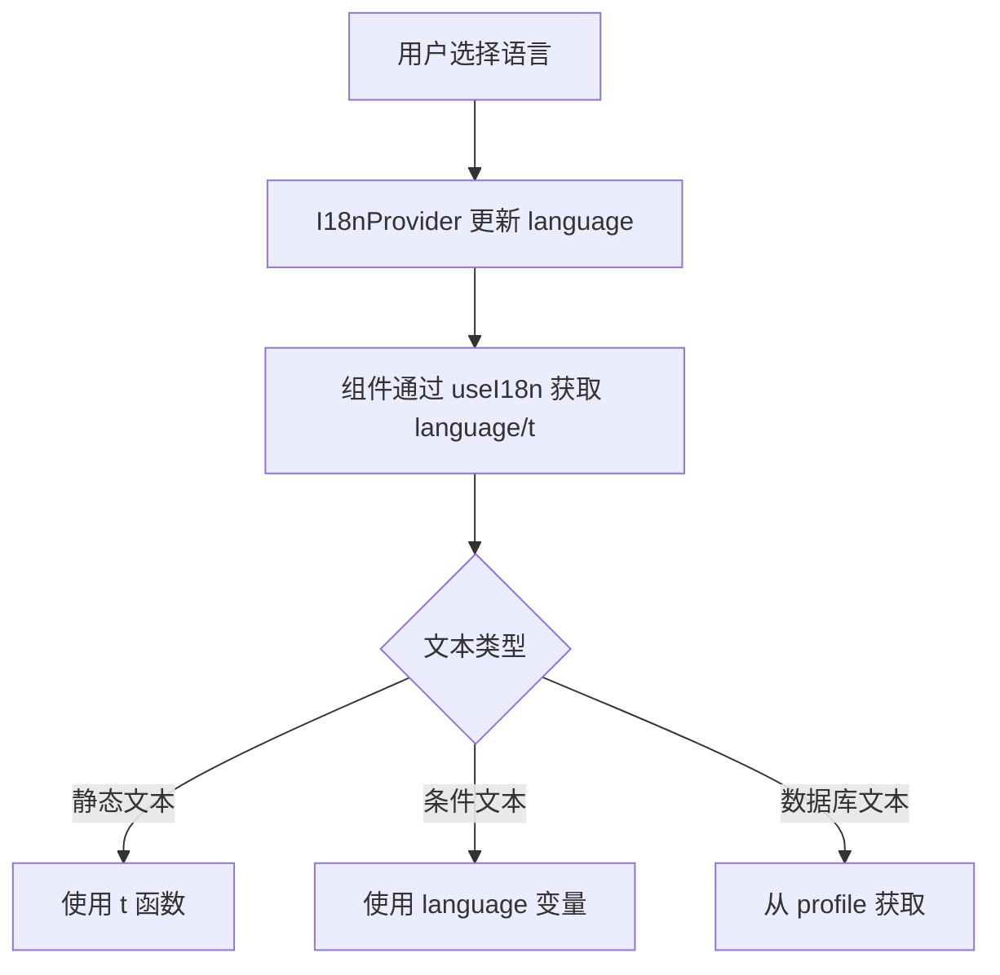

# 设计文档

## 概述

本设计文档描述了 No More Anxious 应用的国际化（i18n）同步功能的实现方案。目标是确保所有面向用户的文本在中文和英文之间正确同步，消除用户切换语言时出现的中英混杂问题。

## 架构

### 现有 i18n 系统

应用已有一个基于 React Context 的 i18n 系统：

```
lib/i18n.tsx
├── I18nProvider (Context Provider)
├── useI18n Hook (提供 language, setLanguage, t 函数)
└── translations 对象 (zh/en 翻译字典)
```

### 同步策略

采用增量修复策略，不改变现有架构：

1. **扩展翻译字典** - 在 `lib/i18n.tsx` 中添加缺失的翻译键
2. **组件级修复** - 逐个组件替换硬编码文本为 `t()` 调用或条件渲染
3. **数据驱动文本** - 对于数据库中的内容（如用户名），确保正确获取



## 组件和接口

### 需要修改的组件

| 组件 | 文件路径 | 修改类型 |
|------|----------|----------|
| DailyInsightHub | components/DailyInsightHub.tsx | 添加翻译键 |
| DailyQuestionnaire | components/DailyQuestionnaire.tsx | 添加翻译键 |
| AnalysisClientView | app/analysis/AnalysisClientView.tsx | 添加翻译键 + 用户名修复 |
| BayesianDashboardPage | app/bayesian/page.tsx | 添加翻译键 |
| PlansPage | app/plans/page.tsx | 添加翻译键 |
| SettingsClient | app/settings/SettingsClient.tsx | 添加翻译键 |
| UpgradePage | app/onboarding/upgrade/page.tsx | 添加翻译键 |
| Loading | app/loading.tsx | 添加翻译键 |
| AssistantPage | app/assistant/page.tsx | 添加翻译键 |

### 翻译键命名规范

```
{页面/组件}.{区域}.{元素}

示例：
- analysis.loading.text
- bayesian.anxiety.label
- plans.header.title
- settings.body.height
- upgrade.cta.button
```

## 数据模型

### 翻译字典结构

```typescript
// lib/i18n.tsx
export const translations: Record<Language, Record<string, string>> = {
  zh: {
    // 分析页面
    'analysis.loading.text': 'AI 正在分析你的代谢指纹...',
    'analysis.header.decoder': 'AI 代谢解码器',
    'analysis.status.recovery': '压力恢复期',
    // ... 更多翻译
  },
  en: {
    // Analysis page
    'analysis.loading.text': 'AI is analyzing your metabolic fingerprint...',
    'analysis.header.decoder': 'AI Metabolic Decoder',
    'analysis.status.recovery': 'Stress Recovery Period',
    // ... more translations
  }
};
```

### 用户名数据流

```
Supabase profiles 表
    ↓
profile.full_name
    ↓
AnalysisClientView 组件
    ↓
显示用户名（非硬编码）
```

## 正确性属性

*属性是系统在所有有效执行中应保持为真的特征或行为——本质上是关于系统应该做什么的正式声明。属性作为人类可读规范和机器可验证正确性保证之间的桥梁。*

### 属性 1: 翻译键完整性
*对于任意*翻译键，如果它在 'zh' 语言中存在，则它也必须在 'en' 语言中存在，反之亦然
**验证: 需求 2.2**

### 属性 2: 语言一致性
*对于任意*组件和任意语言设置，组件渲染的所有用户可见文本应与当前语言设置一致（不应出现中英混杂）
**验证: 需求 1.1, 1.2, 1.3, 3.1, 3.2, 4.1, 4.2**

### 属性 3: 问卷本地化完整性
*对于任意*问卷问题，其 question 和 questionEn 字段都必须存在且非空，其 options 和 optionsEn 数组长度必须相等
**验证: 需求 3.1, 3.2**

### 属性 4: 用户名数据一致性
*对于任意*显示用户名的页面，显示的名称应与数据库 profiles 表中的 full_name 字段一致
**验证: 需求 6.3**

## 错误处理

### 翻译键缺失

当翻译键不存在时，`t()` 函数返回键本身作为后备：

```typescript
const t = useCallback((key: string): string => {
  return translations[language]?.[key] || key;
}, [language]);
```

### 用户名缺失

当用户名为空时，使用默认值：

```typescript
const displayName = profile?.full_name || t('common.friend');
```

## 测试策略

### 单元测试

- 测试 `t()` 函数对所有翻译键的返回值
- 测试翻译字典的完整性（zh/en 键对称）
- 测试组件在不同语言设置下的渲染输出

### 属性测试

使用 fast-check 库进行属性测试：

1. **翻译键完整性测试** - 验证所有 zh 键在 en 中存在
2. **语言一致性测试** - 生成随机语言设置，验证组件文本语言一致
3. **问卷本地化测试** - 验证所有问题都有双语版本

### 测试框架

- 测试框架: Vitest
- 属性测试库: fast-check
- 测试文件位置: `__tests__/properties/i18n.test.ts`
