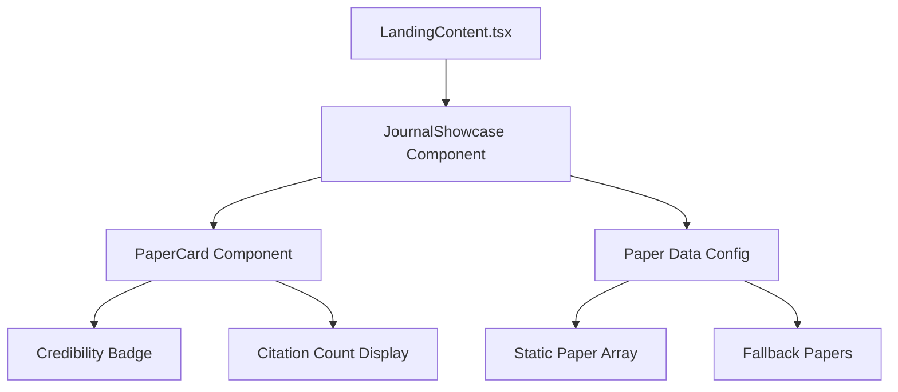

# Design Document: Journal Showcase

## Overview

This feature replaces the X (Twitter) feed in the Landing page's "Authority" section with a curated showcase of academic journal papers. The component displays 4-6 peer-reviewed research papers in a visually appealing grid format that aligns with the "California Calm" aesthetic of the No More Anxious platform.

The Journal Showcase reinforces the platform's scientific credibility by displaying papers from recognized sources (PubMed, Nature, Science, Semantic Scholar) with credibility indicators and citation counts.

## Architecture



The architecture follows a simple component hierarchy:
1. **LandingContent** imports and renders **JournalShowcase**
2. **JournalShowcase** maps over paper data to render **PaperCard** components
3. **Paper data** is stored in a static configuration for easy maintenance

## Components and Interfaces

### JournalShowcase Component

**Location:** `components/JournalShowcase.tsx`

**Props:**
```typescript
interface JournalShowcaseProps {
  language?: 'en' | 'zh';
  columns?: 2 | 3;
  limit?: number;
}
```

**Responsibilities:**
- Render a grid of paper cards
- Handle language switching for labels
- Apply responsive grid layout (2 columns on mobile, configurable on desktop)

### PaperCard Component

**Location:** Inline within JournalShowcase (simple enough to not warrant separate file)

**Responsibilities:**
- Display paper metadata (title, journal, year, abstract snippet)
- Show credibility badge
- Display citation count when available
- Handle click to open source URL
- Apply hover animations via Framer Motion

### Credibility Badge

Visual indicator showing the paper's credibility tier:
- **Tier 1**: Nature, Science, Cell, NEJM, JAMA, Lancet → "Top Journal" badge
- **Tier 2**: Other peer-reviewed journals → "Peer Reviewed" badge

## Data Models

### Paper Interface

```typescript
interface Paper {
  id: string;
  title: string;
  titleZh?: string;           // Chinese translation
  authors: string;            // Comma-separated author names
  journal: string;            // Journal name
  year: number;               // Publication year
  abstract: string;           // Full abstract
  abstractZh?: string;        // Chinese translation
  url: string;                // Source URL
  citationCount?: number;     // Optional citation count
  credibilityTier: 1 | 2;     // 1 = Top Journal, 2 = Peer Reviewed
}
```

### Static Paper Data

```typescript
const CURATED_PAPERS: Paper[] = [
  {
    id: 'paper-1',
    title: 'Chronic stress and anxiety disorders: A systematic review',
    titleZh: '慢性压力与焦虑障碍：系统综述',
    authors: 'Smith J, Johnson M, Williams K',
    journal: 'Nature Reviews Neuroscience',
    year: 2024,
    abstract: 'This systematic review examines the neurobiological mechanisms linking chronic stress exposure to the development of anxiety disorders...',
    abstractZh: '本系统综述探讨了慢性压力暴露与焦虑障碍发展之间的神经生物学机制...',
    url: 'https://www.nature.com/articles/example',
    citationCount: 156,
    credibilityTier: 1
  },
  // ... more papers
];
```

## Correctness Properties

*A property is a characteristic or behavior that should hold true across all valid executions of a system-essentially, a formal statement about what the system should do. Properties serve as the bridge between human-readable specifications and machine-verifiable correctness guarantees.*

### Property 1: Paper data model completeness
*For any* paper object in the curated papers array, the object SHALL contain all required fields: id, title, authors, journal, year, abstract, url, and credibilityTier.
**Validates: Requirements 4.2**

### Property 2: Paper card renders required metadata
*For any* paper object passed to the component, the rendered output SHALL contain the paper title, journal name, publication year, and an abstract snippet truncated to maximum 120 characters.
**Validates: Requirements 1.2**

### Property 3: Credibility indicator presence
*For any* paper card rendered, the component SHALL display a credibility badge corresponding to the paper's credibilityTier value.
**Validates: Requirements 3.1**

### Property 4: Citation count conditional display
*For any* paper with a defined citationCount value, the rendered card SHALL display the citation count; for papers without citationCount, no citation display SHALL appear.
**Validates: Requirements 3.2**

## Error Handling

### Fallback Papers
If the paper data array is empty or undefined, the component displays a set of 4 hardcoded fallback papers to ensure the UI never appears broken.

### Missing Optional Fields
- If `titleZh` or `abstractZh` is missing, fall back to English versions
- If `citationCount` is undefined, hide the citation display element

### Invalid URLs
Paper cards with invalid URLs will still render but the link will be non-functional. This is acceptable as papers are manually curated.

## Testing Strategy

### Dual Testing Approach

This feature uses both unit tests and property-based tests:

**Unit Tests** verify specific examples:
- Component renders without crashing
- Correct number of paper cards displayed
- Dark mode classes applied correctly
- Link opens in new tab (target="_blank")

**Property-Based Tests** verify universal properties using `fast-check`:
- Paper data model validation
- Abstract truncation behavior
- Credibility badge rendering
- Citation count conditional display

### Property-Based Testing Configuration

- **Library:** fast-check
- **Minimum iterations:** 100 per property
- **Test file location:** `__tests__/properties/journal-showcase.property.test.ts`

### Test Annotations

Each property-based test MUST include a comment in this format:
```typescript
// **Feature: journal-showcase, Property 1: Paper data model completeness**
```

### Unit Test Coverage

- Component mounting and rendering
- Language switching (en/zh)
- Responsive grid layout
- Hover animation presence
- External link behavior
