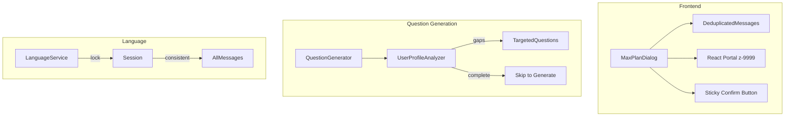

# Design Document: Max Plan Dialog Fixes

## Overview

本设计文档针对 Max 计划对话框的五个核心问题进行修复：消息重复、层级问题、问题针对性不足、确认按钮设计问题、以及语言混合问题。修复将在现有代码基础上进行增量改进，保持向后兼容。

### 核心设计原则

1. **去重优先**: 使用消息 ID 和内容哈希双重机制防止重复
2. **层级隔离**: 使用 Portal 和高 z-index 确保对话框始终在最上层
3. **数据驱动**: 问题生成基于用户完整数据画像，避免冗余询问
4. **固定底部**: 确认按钮使用 sticky 定位，始终可见
5. **语言锁定**: 会话开始时锁定语言，全程保持一致

## Architecture



## Components and Interfaces

### 1. Message Deduplication

```typescript
interface MessageDeduplicator {
  /** 已显示消息的 ID 集合 */
  displayedIds: Set<string>;
  /** 已显示消息的内容哈希集合 */
  contentHashes: Set<string>;
  
  /** 检查消息是否重复 */
  isDuplicate(message: ChatMessage): boolean;
  
  /** 标记消息为已显示 */
  markDisplayed(message: ChatMessage): void;
  
  /** 重置去重状态 */
  reset(): void;
}

/** 计算消息内容哈希 */
function hashContent(content: string): string {
  // 简单哈希：取内容前50字符 + 长度
  return `${content.slice(0, 50)}_${content.length}`;
}
```

### 2. Dialog Portal with High Z-Index

```typescript
interface DialogPortalProps {
  isOpen: boolean;
  children: React.ReactNode;
  /** 最小 z-index 值 */
  minZIndex?: number; // default: 9999
}

// 使用 React Portal 渲染到 document.body
// 确保脱离当前 DOM 层级
```

### 3. Enhanced Question Generator

```typescript
interface UserDataProfile {
  /** 问询数据 */
  inquiry: {
    hasData: boolean;
    lastUpdated: Date | null;
    topics: string[];
  };
  /** 校准数据 */
  calibration: {
    hasData: boolean;
    lastUpdated: Date | null;
    sleepQuality?: string;
    stressLevel?: string;
    energyLevel?: string;
    mood?: string;
  };
  /** HRV 数据 */
  hrv: {
    hasData: boolean;
    lastUpdated: Date | null;
  };
  /** 历史计划 */
  planHistory: {
    count: number;
    lastPlanDate: Date | null;
    completionRate?: number;
  };
}

interface EnhancedQuestionGenerator {
  /** 分析用户数据画像 */
  analyzeProfile(userId: string): Promise<UserDataProfile>;
  
  /** 识别数据缺口 */
  identifyGaps(profile: UserDataProfile): DataGap[];
  
  /** 生成针对性问题 */
  generateTargetedQuestions(
    gaps: DataGap[],
    language: 'zh' | 'en'
  ): GeneratedQuestion[];
}

interface DataGap {
  type: 'concern' | 'sleep' | 'stress' | 'energy' | 'mood' | 'goal';
  priority: number;
  reason: string;
}
```

### 4. Sticky Confirm Button

```typescript
interface StickyFooterProps {
  children: React.ReactNode;
  /** 是否显示 */
  visible: boolean;
}

// CSS 实现
const stickyFooterStyles = {
  position: 'sticky',
  bottom: 0,
  left: 0,
  right: 0,
  padding: '16px',
  backgroundColor: 'white',
  borderTop: '1px solid rgba(0,0,0,0.1)',
  zIndex: 10, // 相对于对话框内部
};

const confirmButtonStyles = {
  width: '100%',
  minHeight: '48px',
  backgroundColor: '#0B3D2E',
  color: 'white',
  borderRadius: '8px',
};
```

### 5. Language Lock Service

```typescript
interface LanguageLockService {
  /** 会话语言（一旦设置不可更改） */
  sessionLanguage: 'zh' | 'en' | null;
  
  /** 锁定会话语言 */
  lockLanguage(language: 'zh' | 'en'): void;
  
  /** 获取当前会话语言 */
  getLanguage(): 'zh' | 'en';
  
  /** 检查是否已锁定 */
  isLocked(): boolean;
  
  /** 重置（仅在会话结束时调用） */
  reset(): void;
}
```

## Data Models

### Session State Extension

```typescript
interface EnhancedSessionState {
  // 现有字段...
  
  /** 消息去重器 */
  deduplicator: {
    displayedIds: string[];
    contentHashes: string[];
  };
  
  /** 锁定的语言 */
  lockedLanguage: 'zh' | 'en';
  
  /** 用户数据画像 */
  userProfile: UserDataProfile;
  
  /** 已识别的数据缺口 */
  dataGaps: DataGap[];
}
```

## Correctness Properties

*A property is a characteristic or behavior that should hold true across all valid executions of a system-essentially, a formal statement about what the system should do. Properties serve as the bridge between human-readable specifications and machine-verifiable correctness guarantees.*

### Property 1: Message Uniqueness

*For any* sequence of messages in a dialog session, no two consecutive messages SHALL have the same content, AND all message IDs SHALL be unique within the session.

**Validates: Requirements 1.1, 1.2, 1.3, 1.4**

### Property 2: Data-Aware Question Generation

*For any* user profile with existing data, the generated questions SHALL NOT ask about information that is already present and recent (within 7 days) in the profile. Specifically, if calibration data exists with sleep quality, the system SHALL NOT generate a sleep question.

**Validates: Requirements 3.2, 3.3, 3.4**

### Property 3: Question Count Bounds

*For any* user data state, the number of generated questions SHALL be between 0 and 5 (inclusive). When the user has comprehensive recent data, the question count SHALL be 0 or 1.

**Validates: Requirements 3.5, 3.6**

### Property 4: Language Consistency

*For any* dialog session with a locked language preference, ALL messages (Max messages, user messages, options, plan items) SHALL be in that language. No message SHALL contain text in a different language.

**Validates: Requirements 5.1, 5.2, 5.3, 5.4, 5.6**

## Error Handling

### Error Categories

1. **Duplicate Detection Errors**: 静默跳过，记录日志
2. **Portal Mount Errors**: 降级到普通渲染
3. **Profile Fetch Errors**: 使用默认问题集
4. **Language Detection Errors**: 默认使用中文

### Error Messages (California Calm Style)

```typescript
const ERROR_MESSAGES = {
  zh: {
    profileFetch: '正在用现有信息为你准备...',
    questionGeneration: '让我换个方式了解你...',
  },
  en: {
    profileFetch: 'Preparing with available information...',
    questionGeneration: 'Let me try a different approach...',
  },
};
```

## Testing Strategy

### Unit Tests

- 消息去重逻辑测试
- 内容哈希函数测试
- 语言锁定服务测试
- 数据缺口识别测试

### Property-Based Tests

使用 fast-check 库进行属性测试，每个测试最少运行 100 次迭代：

1. **Property 1 (Message Uniqueness)**: 生成随机消息序列，验证去重后无连续重复且 ID 唯一
   - Tag: `Feature: max-plan-dialog-fixes, Property 1: Message Uniqueness`

2. **Property 2 (Data-Aware Question Generation)**: 生成随机用户画像，验证问题不询问已有数据
   - Tag: `Feature: max-plan-dialog-fixes, Property 2: Data-Aware Question Generation`

3. **Property 3 (Question Count Bounds)**: 生成随机数据状态，验证问题数量在 0-5 范围内
   - Tag: `Feature: max-plan-dialog-fixes, Property 3: Question Count Bounds`

4. **Property 4 (Language Consistency)**: 生成随机会话，验证所有文本语言一致
   - Tag: `Feature: max-plan-dialog-fixes, Property 4: Language Consistency`

### Integration Tests

- 对话框打开/关闭层级测试
- 确认按钮可见性测试
- 完整对话流程语言一致性测试

### Test Configuration

- 使用 Vitest 作为测试框架
- 使用 fast-check 进行属性测试
- 属性测试最少运行 100 次迭代
- 每个属性测试标注对应的设计属性编号

