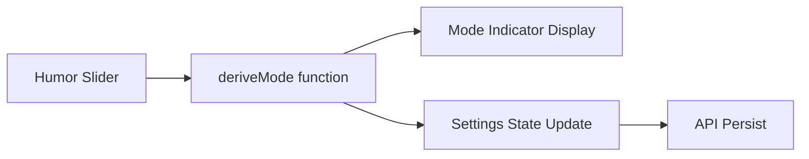

# Design Document: Max Settings Redesign

## Overview

This design document outlines the changes to the Max AI Settings interface to simplify user experience by:
1. Unifying the AI name as "Max"
2. Auto-deriving personality mode from humor level slider
3. Reorganizing the layout (honesty → humor order)
4. Removing manual personality mode card selection

The core change is introducing a **derived mode** concept where the `mode` field in `AISettings` is computed from `humor_level` rather than being independently selected.

## Architecture

### Component Structure

```
MaxSettings (Container)
├── Header Section
│   ├── Max Icon + Title ("Max Configuration")
│   └── Status Indicator
├── Feedback Display
│   └── Max Response Area
├── Honesty Slider Section (2nd)
│   └── PremiumSlider (honesty_level)
├── Humor Slider Section (3rd)
│   ├── PremiumSlider (humor_level)
│   └── PersonalityModeIndicator (derived, read-only)
└── Footer
```

### Data Flow



## Components and Interfaces

### Modified Types

```typescript
// types/max.ts - Updated
export type MaxMode = 'MAX' | 'Zen Master' | 'Dr. House';

// Mode derivation thresholds
export const MODE_THRESHOLDS = {
  DR_HOUSE: { min: 0, max: 33 },
  ZEN_MASTER: { min: 33, max: 66 },
  MAX: { min: 66, max: 100 }
} as const;

// Mode display info
export const MODE_INFO: Record<MaxMode, { label: string; sublabel: string; color: string }> = {
  'Dr. House': { label: 'Dr. House', sublabel: '直接-诊断', color: '#C4A77D' },
  'Zen Master': { label: 'Zen Master', sublabel: '平静-哲学', color: '#9CAF88' },
  'MAX': { label: 'MAX', sublabel: '简洁-幽默', color: '#E8DFD0' }
};
```

### New Functions

```typescript
// Derive mode from humor level
function deriveMode(humorLevel: number): MaxMode {
  if (humorLevel < 33) return 'Dr. House';
  if (humorLevel < 66) return 'Zen Master';
  return 'MAX';
}
```

### PersonalityModeIndicator Component

A new read-only component that displays the current derived personality mode:

```typescript
interface PersonalityModeIndicatorProps {
  mode: MaxMode;
  isTransitioning: boolean;
}
```

## Data Models

### AISettings (Updated)

```typescript
interface AISettings {
  honesty_level: number;  // 60-100
  humor_level: number;    // 0-100
  mode: MaxMode;          // Derived from humor_level, stored for API compatibility
}
```

### Mode Derivation Logic

| Humor Level | Derived Mode | Style Description |
|-------------|--------------|-------------------|
| 0-32        | Dr. House    | 直接-诊断 (Direct, Diagnostic) |
| 33-65       | Zen Master   | 平静-哲学 (Calm, Philosophical) |
| 66-100      | MAX          | 简洁-幽默 (Concise, Witty) |


## Correctness Properties

*A property is a characteristic or behavior that should hold true across all valid executions of a system-essentially, a formal statement about what the system should do. Properties serve as the bridge between human-readable specifications and machine-verifiable correctness guarantees.*

Based on the prework analysis, the following properties can be combined and tested:

### Property 1: Mode Derivation Correctness

*For any* humor level value in the valid range [0, 100], the `deriveMode` function SHALL return:
- "Dr. House" when humor_level is in [0, 33)
- "Zen Master" when humor_level is in [33, 66)
- "MAX" when humor_level is in [66, 100]

**Validates: Requirements 2.1, 2.2, 2.3**

### Property 2: Mode Color Mapping Correctness

*For any* derived mode, the `getModeColor` function SHALL return the correct color:
- "Dr. House" → "#C4A77D"
- "Zen Master" → "#9CAF88"
- "MAX" → "#E8DFD0"

**Validates: Requirements 5.2**

### Property 3: Mode Label Mapping Correctness

*For any* derived mode, the mode info SHALL contain the correct Chinese sublabel:
- "Dr. House" → "直接-诊断"
- "Zen Master" → "平静-哲学"
- "MAX" → "简洁-幽默"

**Validates: Requirements 2.1, 2.2, 2.3**

## Error Handling

### Invalid Humor Level Values

- If humor_level < 0, clamp to 0 and derive "Dr. House"
- If humor_level > 100, clamp to 100 and derive "MAX"
- If humor_level is NaN or undefined, default to 65 (Zen Master range)

### API Failures

- If settings persist fails, show comforting toast: "Let's try that again gently"
- Retain local state and retry on next interaction
- Do not block UI interaction during API calls

## Testing Strategy

### Property-Based Testing

The project uses **fast-check** for property-based testing (already configured in vitest.config.ts).

Each property-based test MUST:
1. Run a minimum of 100 iterations
2. Be tagged with a comment referencing the correctness property
3. Use the format: `**Feature: max-settings-redesign, Property {number}: {property_text}**`

### Unit Tests

Unit tests will cover:
- Component rendering with correct layout order
- Absence of mode selection cards
- Presence of mode indicator near humor slider
- API call verification on mode change

### Test File Structure

```
components/max/__tests__/
├── deriveMode.property.test.ts    # Property tests for mode derivation
└── MaxSettings.test.tsx           # Unit tests for component behavior
```
