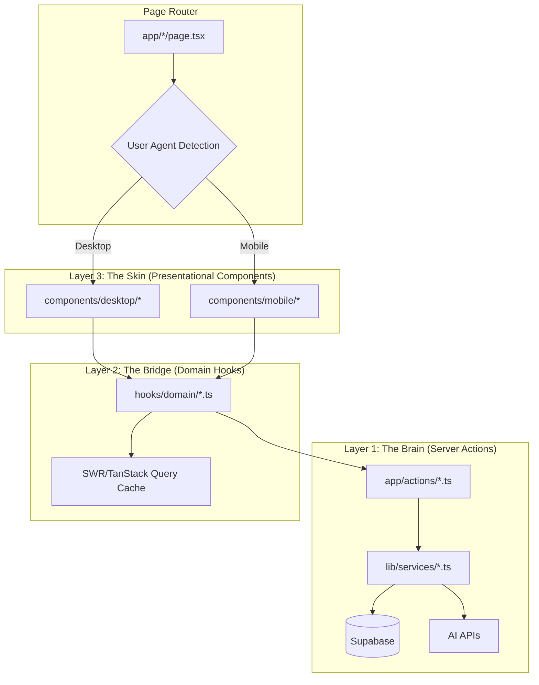

# Design Document: MVVM Architecture Refactor

## Overview

本设计文档描述了 No More Anxious 应用的 MVVM 三层分离架构重构方案。该架构解决了 Next.js App Router + Capacitor 组合中 Server/Client Component 混乱导致的"功能丢失"问题。

核心设计理念：
- **The Brain (Server Actions)**: 纯后端逻辑，零 UI 代码，可单元测试
- **The Bridge (Domain Hooks)**: 状态管理层，连接后端和前端，平台无关
- **The Skin (Presentational Components)**: 纯展示层，Desktop 和 Mobile 分离

## Architecture



## Components and Interfaces

### 1. Server Actions Layer (`app/actions/`)

Server Actions 是纯服务端函数，负责所有后端交互。

```typescript
// app/actions/dashboard.ts
'use server';

import { createServerSupabaseClient } from '@/lib/supabase-server';

// 标准返回类型
export interface ActionResult<T> {
  success: boolean;
  data?: T;
  error?: string;
}

// Dashboard 数据类型
export interface DashboardData {
  profile: UnifiedProfile | null;
  weeklyLogs: WellnessLog[];
  hardwareData: HardwareData | null;
}

export async function getDashboardData(): Promise<ActionResult<DashboardData>> {
  const supabase = await createServerSupabaseClient();
  const { data: { user } } = await supabase.auth.getUser();
  
  if (!user) {
    return { success: false, error: 'Unauthorized' };
  }
  
  // ... fetch data from Supabase
  return { success: true, data: { profile, weeklyLogs, hardwareData } };
}

export async function syncProfile(): Promise<ActionResult<void>> {
  // ... trigger profile aggregation
}
```

### 2. Domain Hooks Layer (`hooks/domain/`)

Domain Hooks 封装业务逻辑和状态管理，是 Desktop 和 Mobile 共享的桥梁。

```typescript
// hooks/domain/useDashboard.ts
'use client';

import useSWR from 'swr';
import { getDashboardData, syncProfile, DashboardData } from '@/app/actions/dashboard';

export interface UseDashboardReturn {
  // Data
  profile: UnifiedProfile | null;
  weeklyLogs: WellnessLog[];
  hardwareData: HardwareData | null;
  
  // States
  isLoading: boolean;
  isSyncing: boolean;
  isOffline: boolean;
  error: string | null;
  
  // Actions
  sync: () => Promise<void>;
  refresh: () => Promise<void>;
  
  // Optimistic UI support
  mutate: (data?: DashboardData, shouldRevalidate?: boolean) => Promise<void>;
}

export function useDashboard(): UseDashboardReturn {
  const { data, error, isLoading, mutate } = useSWR(
    'dashboard',
    async () => {
      const result = await getDashboardData();
      if (!result.success) throw new Error(result.error);
      return result.data;
    },
    {
      revalidateOnFocus: false,
      dedupingInterval: 30000,
    }
  );
  
  const [isSyncing, setIsSyncing] = useState(false);
  const { isOnline } = useNetwork();
  
  const sync = async () => {
    setIsSyncing(true);
    try {
      await syncProfile();
      await mutate();
    } finally {
      setIsSyncing(false);
    }
  };
  
  return {
    profile: data?.profile ?? null,
    weeklyLogs: data?.weeklyLogs ?? [],
    hardwareData: data?.hardwareData ?? null,
    isLoading,
    isSyncing,
    isOffline: !isOnline,
    error: error?.message ?? null,
    sync,
    refresh: () => mutate(),
    mutate: async (newData, shouldRevalidate = true) => {
      await mutate(newData, shouldRevalidate);
    },
  };
}
```

#### Optimistic Update Pattern Example

```typescript
// hooks/domain/usePaperLike.ts - Example with optimistic UI
'use client';

import useSWR, { useSWRConfig } from 'swr';
import { togglePaperLike } from '@/app/actions/papers';

export interface UsePaperLikeReturn {
  isLiked: boolean;           // Server-confirmed state
  optimisticLiked: boolean;   // UI-priority state (use this for rendering)
  isUpdating: boolean;
  toggleLike: () => Promise<void>;
}

export function usePaperLike(paperId: string): UsePaperLikeReturn {
  const { data, mutate } = useSWR(`paper-like-${paperId}`, () => getPaperLikeStatus(paperId));
  const [optimisticLiked, setOptimisticLiked] = useState<boolean | null>(null);
  const [isUpdating, setIsUpdating] = useState(false);
  
  const toggleLike = async () => {
    const previousState = data?.isLiked ?? false;
    const newState = !previousState;
    
    // 1. Optimistic update - instant UI feedback
    setOptimisticLiked(newState);
    setIsUpdating(true);
    
    try {
      // 2. Call Server Action
      const result = await togglePaperLike(paperId);
      
      if (!result.success) {
        // 3a. Rollback on failure
        setOptimisticLiked(previousState);
        throw new Error(result.error);
      }
      
      // 3b. Confirm with server data
      await mutate();
      setOptimisticLiked(null); // Clear optimistic, use server state
    } catch (error) {
      setOptimisticLiked(previousState); // Rollback
      throw error;
    } finally {
      setIsUpdating(false);
    }
  };
  
  return {
    isLiked: data?.isLiked ?? false,
    optimisticLiked: optimisticLiked ?? data?.isLiked ?? false,
    isUpdating,
    toggleLike,
  };
}
```
```

### 3. Presentational Components Layer

#### Desktop Component (`components/desktop/Dashboard.tsx`)

```typescript
'use client';

import { UseDashboardReturn } from '@/hooks/domain/useDashboard';

interface DesktopDashboardProps {
  dashboard: UseDashboardReturn;
}

export function DesktopDashboard({ dashboard }: DesktopDashboardProps) {
  const { profile, weeklyLogs, isLoading, sync, isSyncing } = dashboard;
  
  if (isLoading) return <LoadingSkeleton />;
  
  return (
    <div className="grid grid-cols-3 gap-4">
      {/* Shadcn UI components, minimal animations */}
    </div>
  );
}
```

#### Mobile Component (`components/mobile/Dashboard.tsx`)

```typescript
'use client';

import { motion, AnimatePresence } from 'framer-motion';
import { useHaptics } from '@/hooks/useHaptics';
import { UseDashboardReturn } from '@/hooks/domain/useDashboard';

interface MobileDashboardProps {
  dashboard: UseDashboardReturn;
}

export function MobileDashboard({ dashboard }: MobileDashboardProps) {
  const { profile, weeklyLogs, isLoading, sync, isSyncing, isOffline } = dashboard;
  const { impact } = useHaptics();
  
  const handleSync = async () => {
    await impact('medium');
    await sync();
  };
  
  if (isLoading) return <LottieLoader />;
  
  return (
    <motion.div
      initial={{ opacity: 0, y: 20 }}
      animate={{ opacity: 1, y: 0 }}
    >
      {isOffline && <OfflineBanner />}
      {/* Framer Motion animations, haptic feedback */}
    </motion.div>
  );
}
```

### 4. Page Router (`app/dashboard/page.tsx`)

```typescript
import { headers } from 'next/headers';
import { DashboardClient } from './DashboardClient';

// CRITICAL: Prevent Vercel edge caching of device-specific HTML
export const dynamic = 'force-dynamic';

function isMobileUserAgent(userAgent: string | null): boolean {
  if (!userAgent) return false;
  return /Android|webOS|iPhone|iPad|iPod|BlackBerry|IEMobile|Opera Mini/i.test(userAgent);
}

export default async function DashboardPage() {
  const headersList = await headers();
  
  // Capacitor header is authoritative - always trust it
  const capacitorPlatform = headersList.get('x-capacitor-platform');
  const userAgent = headersList.get('user-agent');
  
  // Priority: Capacitor header > User-Agent detection
  const isMobile = capacitorPlatform 
    ? ['ios', 'android'].includes(capacitorPlatform.toLowerCase())
    : isMobileUserAgent(userAgent);
  
  return <DashboardClient isMobile={isMobile} />;
}
```

```typescript
// app/dashboard/DashboardClient.tsx
'use client';

import { useDashboard } from '@/hooks/domain/useDashboard';
import { DesktopDashboard } from '@/components/desktop/Dashboard';
import { MobileDashboard } from '@/components/mobile/Dashboard';

interface DashboardClientProps {
  isMobile: boolean;
}

export function DashboardClient({ isMobile }: DashboardClientProps) {
  const dashboard = useDashboard();
  
  return isMobile 
    ? <MobileDashboard dashboard={dashboard} />
    : <DesktopDashboard dashboard={dashboard} />;
}
```

## Data Models

### UnifiedProfile

```typescript
interface UnifiedProfile {
  demographics: {
    gender?: string;
    age?: number;
    bmi?: number;
  };
  health_goals: Array<{ goal_text: string; category: string }>;
  health_concerns: string[];
  lifestyle_factors: {
    sleep_hours?: number;
    exercise_frequency?: string;
    stress_level?: string;
  };
  recent_mood_trend: 'improving' | 'stable' | 'declining';
  ai_inferred_traits: Record<string, unknown>;
  last_aggregated_at: string;
}
```

### WellnessLog

```typescript
interface WellnessLog {
  log_date: string;
  sleep_duration_minutes: number | null;
  mood_status: string | null;
  stress_level: number | null;
}
```

### HardwareData

```typescript
interface HardwareData {
  hrv?: { value: number; source: string; recorded_at: string };
  resting_heart_rate?: { value: number; source: string; recorded_at: string };
  sleep_score?: { value: number; source: string; recorded_at: string };
  spo2?: { value: number; source: string; recorded_at: string };
}
```

### ActionResult<T>

```typescript
// IMPORTANT: All data in ActionResult must be JSON-serializable
// No Date objects, class instances, Set, Map, or functions
interface ActionResult<T> {
  success: boolean;
  data?: T;  // Must be plain JSON (POJO)
  error?: string;
}

// Example DTO transformation in Server Action:
// ❌ BAD: return { success: true, data: { createdAt: new Date() } }
// ✅ GOOD: return { success: true, data: { createdAt: date.toISOString() } }
```


## Correctness Properties

*A property is a characteristic or behavior that should hold true across all valid executions of a system—essentially, a formal statement about what the system should do. Properties serve as the bridge between human-readable specifications and machine-verifiable correctness guarantees.*

### Property 1: Layer Isolation - No UI Imports in Logic Layers

*For any* Server Action file in `app/actions/` or Domain Hook file in `hooks/domain/`, the file SHALL NOT import any UI-related modules (React components, framer-motion, @/components/*, JSX).

**Validates: Requirements 1.2, 2.6**

### Property 2: ActionResult Format Consistency

*For any* Server Action function, when called with any input (valid or invalid), the return value SHALL match the `ActionResult<T>` interface with `{ success: boolean; data?: T; error?: string }` structure.

**Validates: Requirements 1.4**

### Property 3: Domain Hook Interface Pattern

*For any* Domain Hook in `hooks/domain/`, the return value SHALL include at minimum: a data field, an `isLoading` boolean, an `error` field (string or null), and at least one action function.

**Validates: Requirements 2.3, 2.4, 5.3, 5.4**

### Property 4: Offline Caching Behavior

*For any* Domain Hook, when the network status changes from online to offline, the hook SHALL continue to return the last cached data (if available) and set `isOffline: true`.

**Validates: Requirements 2.5, 6.2**

### Property 5: Presentational Component Isolation

*For any* Presentational Component in `components/desktop/` or `components/mobile/`, the file SHALL NOT directly import from `app/actions/`, `@supabase/`, or `lib/supabase-*`.

**Validates: Requirements 3.2, 3.3**

### Property 6: Device-Based Routing

*For any* page that supports both desktop and mobile views, when given a mobile User-Agent string, the page SHALL render the Mobile component; when given a desktop User-Agent or null, the page SHALL render the Desktop component.

**Validates: Requirements 4.1, 4.2, 4.4**

### Property 7: Sync State Management

*For any* Domain Hook with a sync operation, calling the sync function SHALL: (1) set `isSyncing` to true immediately, (2) call the corresponding Server Action, (3) refresh the cached data, (4) set `isSyncing` to false upon completion.

**Validates: Requirements 5.7**

### Property 8: Error Propagation Chain

*For any* error thrown or returned by a Server Action, the error message SHALL be accessible in the Domain Hook's `error` field, and when the hook's `error` is non-null, the Presentational Component SHALL receive it via props.

**Validates: Requirements 7.4**

### Property 9: Serialization Boundary Compliance

*For any* Server Action return value, the `data` field SHALL contain only JSON-serializable values (strings, numbers, booleans, null, arrays, plain objects). No Date objects, class instances, Set, Map, Symbol, or functions.

**Validates: Requirements 7.6, 7.7**

### Property 10: Cache Bypass for Device Detection

*For any* page that performs User-Agent based routing, the page SHALL export `dynamic = 'force-dynamic'` to prevent Vercel edge caching of device-specific HTML.

**Validates: Requirements 4.6**

### Property 11: Optimistic Update Rollback

*For any* Domain Hook with optimistic update support, when the Server Action fails after an optimistic update, the hook SHALL rollback to the previous state and set the error field.

**Validates: Requirements 8.4**

## Error Handling

### Server Action Layer

```typescript
// All Server Actions follow this pattern
export async function someAction(input: Input): Promise<ActionResult<Output>> {
  try {
    const supabase = await createServerSupabaseClient();
    const { data: { user } } = await supabase.auth.getUser();
    
    if (!user) {
      return { success: false, error: 'Please sign in to continue' };
    }
    
    // ... business logic
    
    return { success: true, data: result };
  } catch (error) {
    console.error('Action error:', error);
    return { 
      success: false, 
      error: error instanceof Error ? error.message : 'Something went wrong' 
    };
  }
}
```

### Domain Hook Layer

```typescript
// Hooks transform ActionResult errors into user-friendly states
export function useSomeFeature() {
  const { data, error, isLoading } = useSWR('key', async () => {
    const result = await someAction(input);
    if (!result.success) {
      throw new Error(result.error || 'Unknown error');
    }
    return result.data;
  });
  
  return {
    data,
    isLoading,
    error: error?.message ?? null,
    // ... actions
  };
}
```

### Presentational Layer

```typescript
// Components display errors following "California Calm" principles
function SomeComponent({ error }: Props) {
  if (error) {
    return (
      <div className="p-4 bg-amber-50 rounded-xl border border-amber-200">
        <p className="text-amber-800 text-sm">
          {/* Never alarmist, always solution-oriented */}
          Let's try that again gently. {error}
        </p>
      </div>
    );
  }
  // ... normal render
}
```

## Testing Strategy

### Unit Tests (Vitest)

Unit tests verify specific examples and edge cases:

1. **Server Actions**: Test with mock Supabase client
   - Valid input returns success with data
   - Invalid input returns error
   - Unauthorized user returns auth error

2. **Domain Hooks**: Test with React Testing Library
   - Initial loading state
   - Data loaded state
   - Error state
   - Offline state with cached data

3. **Presentational Components**: Test with React Testing Library
   - Renders loading skeleton when isLoading
   - Renders data when available
   - Renders error message when error
   - Renders offline indicator when isOffline

### Property-Based Tests (fast-check)

Property tests verify universal properties across all inputs:

1. **Layer Isolation Property**: Generate random file paths, verify import restrictions
2. **ActionResult Format Property**: Generate random inputs, verify return type structure
3. **Hook Interface Property**: Verify all hooks return required fields
4. **Device Routing Property**: Generate random User-Agent strings, verify correct component selection
5. **Error Propagation Property**: Generate random errors, verify they flow through layers

### Test Configuration

- Framework: Vitest + fast-check
- Minimum 100 iterations per property test
- Tag format: **Feature: mvvm-architecture-refactor, Property {number}: {property_text}**

```typescript
// Example property test
import { fc } from 'fast-check';
import { describe, it, expect } from 'vitest';

describe('Property 2: ActionResult Format', () => {
  it('should return ActionResult for any input', async () => {
    await fc.assert(
      fc.asyncProperty(
        fc.record({ userId: fc.string() }),
        async (input) => {
          const result = await getDashboardData();
          
          // Must have success boolean
          expect(typeof result.success).toBe('boolean');
          
          // If success, must have data
          if (result.success) {
            expect(result.data).toBeDefined();
          }
          
          // If failure, must have error
          if (!result.success) {
            expect(typeof result.error).toBe('string');
          }
        }
      ),
      { numRuns: 100 }
    );
  });
});
```
