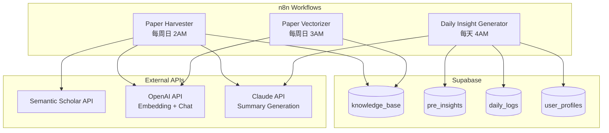

# Design Document: n8n Backend Tasks

## Overview

本设计文档描述了 Neuromind 后台任务层的技术实现方案。n8n 作为"备货"系统，通过定时任务预处理数据，为前端实时服务提供预热内容。

### 核心目标
- **降低延迟**: 用户打开 App 时，洞察已准备好，无需等待 LLM
- **降低成本**: 批量处理比实时调用更经济
- **保持新鲜**: 科学论文库持续更新，RAG 检索更精准

### 架构定位

```
┌─────────────────────────────────────────────────────────┐
│                    n8n (后台备货层)                      │
│  ┌─────────────┐  ┌─────────────┐  ┌─────────────┐     │
│  │科学搬运工   │  │每日洞察生成 │  │论文向量化   │     │
│  │(每周)       │  │(每天4AM)    │  │(每周)       │     │
│  └──────┬──────┘  └──────┬──────┘  └──────┬──────┘     │
│         │                │                │             │
│         └────────────────┼────────────────┘             │
│                          ▼                              │
│              ┌─────────────────────┐                    │
│              │     Supabase        │                    │
│              │  knowledge_base     │                    │
│              │  pre_insights       │                    │
│              │  vectors (pgvector) │                    │
│              └─────────────────────┘                    │
└─────────────────────────────────────────────────────────┘
                           │
                           ▼ 预热数据
┌─────────────────────────────────────────────────────────┐
│              Next.js API (实时服务层)                    │
│  /api/chat → 读取预热 + 实时补充                         │
│  /api/insight → 直接返回预热内容                         │
└─────────────────────────────────────────────────────────┘
```

## Architecture



## Components and Interfaces

### 1. Paper Harvester Workflow

```typescript
interface PaperHarvesterConfig {
  keywords: string[];
  minCitations: number;
  maxPapersPerRun: number;
  cronSchedule: string; // "0 2 * * 0" = Sunday 2AM
}

const DEFAULT_CONFIG: PaperHarvesterConfig = {
  keywords: [
    'metabolic health',
    'HRV heart rate variability',
    'sleep optimization',
    'stress physiology',
    'circadian rhythm',
    'vagus nerve',
    'mitochondrial function'
  ],
  minCitations: 10,
  maxPapersPerRun: 50,
  cronSchedule: '0 2 * * 0'
};
```

**n8n Workflow Steps:**
1. **Trigger**: Cron (Sunday 2:00 AM UTC)
2. **HTTP Request**: Query Semantic Scholar API
3. **Filter**: citation_count >= 10
4. **Loop**: For each paper
   - **HTTP Request**: Claude API - Generate Chinese summary
   - **HTTP Request**: OpenAI API - Generate embedding
   - **Supabase**: Upsert to knowledge_base
5. **Log**: Record processed count

### 2. Daily Insight Generator Workflow

```typescript
interface DailyInsightConfig {
  activeUserDays: number;      // 7 days
  cronSchedule: string;        // "0 4 * * *" = Daily 4AM
  insightPromptTemplate: string;
}

interface UserDailyData {
  userId: string;
  sleepHours: number;
  hrv: number;
  stressLevel: number;
  exerciseMinutes: number;
}

interface GeneratedInsight {
  userId: string;
  insightDate: string;
  content: string;
  dataSummary: UserDailyData;
}
```

**n8n Workflow Steps:**
1. **Trigger**: Cron (Daily 4:00 AM local)
2. **Supabase**: Query active users (last_login > 7 days ago)
3. **Loop**: For each user
   - **Supabase**: Fetch yesterday's daily_logs
   - **IF**: daily_logs exist
     - **HTTP Request**: Claude API - Generate insight
     - **Supabase**: Insert to pre_insights
4. **Log**: Record generated count

**Insight Generation Prompt:**
```
你是 Neuromind 的代谢生理学家。基于用户昨日数据生成一条"早安洞察"。

用户数据:
- 睡眠: {sleep_hours} 小时
- HRV: {hrv} ms
- 压力指数: {stress_level}/10
- 运动: {exercise_minutes} 分钟

规则:
1. 使用"安慰性真相"风格，将数据重构为生物适应性解释
2. 禁止使用: 失败、警告、不足、问题、危险
3. 必须使用: 适应、校准、优先、智能响应、生物电
4. 引用具体数据点
5. 保持 1-2 句话简洁

示例:
- 睡眠 5h → "你的线粒体昨晚进入了高效修复模式，5小时的深度恢复正在为今天的能量储备充电。"
- HRV 45ms → "你的自主神经系统正在精细校准，45ms 的 HRV 反映了身体对近期挑战的智能适应。"
```

### 3. Paper Vectorizer Workflow

```typescript
interface VectorizationConfig {
  embeddingModel: string;      // 'text-embedding-3-small'
  embeddingDimensions: number; // 1536
  batchSize: number;           // 10
}

function shouldVectorize(paper: KnowledgeBasePaper): boolean {
  return paper.embedding === null || paper.content_hash !== computeHash(paper);
}
```

**n8n Workflow Steps:**
1. **Trigger**: Cron (Sunday 3:00 AM UTC, after Paper Harvester)
2. **Supabase**: Query papers where embedding IS NULL
3. **Loop**: For each paper (batch of 10)
   - **HTTP Request**: OpenAI Embedding API
   - **Supabase**: Update embedding column
4. **Log**: Record vectorized count

## Data Models

### knowledge_base Table

```sql
CREATE TABLE knowledge_base (
  id uuid PRIMARY KEY DEFAULT gen_random_uuid(),
  paper_id text UNIQUE NOT NULL,
  title text NOT NULL,
  abstract text,
  summary_zh text,
  keywords text[],
  citation_count integer DEFAULT 0,
  year integer,
  url text,
  doi text,
  source text DEFAULT 'semantic_scholar',
  embedding vector(1536),
  content_hash text,
  created_at timestamptz DEFAULT now(),
  updated_at timestamptz DEFAULT now()
);

-- Index for vector similarity search
CREATE INDEX knowledge_base_embedding_idx 
  ON knowledge_base USING ivfflat (embedding vector_cosine_ops)
  WITH (lists = 100);

-- Index for keyword search
CREATE INDEX knowledge_base_keywords_idx ON knowledge_base USING gin(keywords);
```

### pre_insights Table

```sql
CREATE TABLE pre_insights (
  id uuid PRIMARY KEY DEFAULT gen_random_uuid(),
  user_id uuid NOT NULL REFERENCES auth.users(id) ON DELETE CASCADE,
  insight_date date NOT NULL,
  content text NOT NULL,
  data_summary jsonb,
  generated_at timestamptz DEFAULT now(),
  viewed_at timestamptz,
  UNIQUE(user_id, insight_date)
);

-- Index for quick lookup
CREATE INDEX pre_insights_user_date_idx ON pre_insights(user_id, insight_date DESC);

-- RLS Policy
ALTER TABLE pre_insights ENABLE ROW LEVEL SECURITY;

CREATE POLICY "Users can view own insights" ON pre_insights
  FOR SELECT USING (auth.uid() = user_id);
```

### workflow_health Table (监控)

```sql
CREATE TABLE workflow_health (
  id uuid PRIMARY KEY DEFAULT gen_random_uuid(),
  workflow_name text NOT NULL,
  last_success_at timestamptz,
  last_failure_at timestamptz,
  consecutive_failures integer DEFAULT 0,
  last_error_message text,
  papers_processed integer,
  insights_generated integer,
  updated_at timestamptz DEFAULT now()
);
```

## Correctness Properties

*A property is a characteristic or behavior that should hold true across all valid executions of a system-essentially, a formal statement about what the system should do. Properties serve as the bridge between human-readable specifications and machine-verifiable correctness guarantees.*

### Property 1: Paper Citation Filter
*For any* paper retrieved from Semantic Scholar, if citation_count < 10, the paper SHALL NOT be stored in knowledge_base.
**Validates: Requirements 1.2**

### Property 2: Summary Comforting Truth Style
*For any* generated Chinese summary, the text SHALL NOT contain forbidden words ["失败", "警告", "不足", "问题", "危险", "糟糕"] AND SHALL contain at least one positive framing term ["适应", "校准", "优先", "智能", "生物电", "修复"].
**Validates: Requirements 1.3, 2.3**

### Property 3: Embedding Dimension Consistency
*For any* embedding vector stored in knowledge_base, the vector SHALL have exactly 1536 dimensions.
**Validates: Requirements 1.4, 3.2**

### Property 4: Paper Upsert Idempotency
*For any* paper_id, upserting the same paper twice SHALL result in exactly one record in knowledge_base.
**Validates: Requirements 1.5**

### Property 5: Active User Filter
*For any* user queried for daily insight generation, the user's last_login SHALL be within the past 7 days.
**Validates: Requirements 2.1**

### Property 6: Yesterday's Data Filter
*For any* daily_logs fetched for insight generation, the log's created_at date SHALL be exactly yesterday.
**Validates: Requirements 2.2**

### Property 7: Insight Data Reference
*For any* generated insight where daily_logs exist, the insight content SHALL reference at least one specific data value from the input (sleep_hours, hrv, or stress_level).
**Validates: Requirements 2.4**

### Property 8: Skip Users Without Logs
*For any* user without yesterday's daily_logs, the system SHALL NOT create a pre_insights record for that user.
**Validates: Requirements 2.6**

### Property 9: Exponential Backoff Retry
*For any* API rate limit error, the retry delay SHALL follow exponential pattern: delay_n = base_delay * 2^(n-1) where n is retry attempt.
**Validates: Requirements 4.3**

### Property 10: Unique Insight Per Day
*For any* (user_id, insight_date) pair, there SHALL be at most one record in pre_insights table.
**Validates: Requirements 5.3**

## Error Handling

### API Failures

```typescript
interface RetryConfig {
  maxRetries: number;        // 3
  baseDelayMs: number;       // 1000
  maxDelayMs: number;        // 30000
}

function calculateBackoff(attempt: number, config: RetryConfig): number {
  const delay = config.baseDelayMs * Math.pow(2, attempt - 1);
  return Math.min(delay, config.maxDelayMs);
}
```

### Error Logging

```typescript
interface WorkflowError {
  workflowName: string;
  timestamp: string;
  errorType: 'api_error' | 'db_error' | 'validation_error';
  errorMessage: string;
  context: Record<string, unknown>;
  retryAttempt: number;
}
```

### Alert Thresholds

| 条件 | 动作 |
|------|------|
| 连续失败 >= 3 次 | 发送告警通知 |
| 单次处理 0 条记录 | 记录警告日志 |
| API 响应时间 > 30s | 记录性能警告 |

## Testing Strategy

### Property-Based Testing
使用 **fast-check** 库进行属性测试。

**Configuration:**
- Minimum 100 iterations per property
- Seed-based reproducibility

**Test Annotations:**
```typescript
// **Feature: n8n-backend-tasks, Property {number}: {property_text}**
```

### Unit Testing
- Test filter functions: `filterByCitations`, `filterActiveUsers`, `filterYesterdayLogs`
- Test retry logic: `calculateBackoff`
- Test content validation: `validateComfortingTruth`

### Integration Testing
- Test Supabase upsert operations
- Test embedding dimension validation
- Test workflow health updates

### Mock Strategy
- Mock Semantic Scholar API responses
- Mock OpenAI Embedding API responses
- Mock Claude API responses
- Use Supabase local instance for database tests

## n8n Workflow JSON Templates

### Paper Harvester Workflow Structure

```json
{
  "name": "Paper Harvester",
  "nodes": [
    { "type": "n8n-nodes-base.cron", "name": "Weekly Trigger" },
    { "type": "n8n-nodes-base.httpRequest", "name": "Semantic Scholar API" },
    { "type": "n8n-nodes-base.filter", "name": "Citation Filter" },
    { "type": "n8n-nodes-base.splitInBatches", "name": "Batch Papers" },
    { "type": "n8n-nodes-base.httpRequest", "name": "Claude Summary" },
    { "type": "n8n-nodes-base.httpRequest", "name": "OpenAI Embedding" },
    { "type": "n8n-nodes-base.supabase", "name": "Upsert Paper" }
  ]
}
```

### Daily Insight Generator Workflow Structure

```json
{
  "name": "Daily Insight Generator",
  "nodes": [
    { "type": "n8n-nodes-base.cron", "name": "Daily Trigger" },
    { "type": "n8n-nodes-base.supabase", "name": "Get Active Users" },
    { "type": "n8n-nodes-base.splitInBatches", "name": "Batch Users" },
    { "type": "n8n-nodes-base.supabase", "name": "Get Daily Logs" },
    { "type": "n8n-nodes-base.if", "name": "Has Logs?" },
    { "type": "n8n-nodes-base.httpRequest", "name": "Claude Insight" },
    { "type": "n8n-nodes-base.supabase", "name": "Insert Insight" }
  ]
}
```
