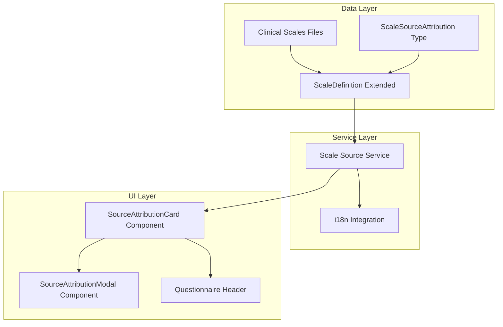

# Design Document: Questionnaire Source Attribution

## Overview

本设计文档描述如何为临床问卷系统增加权威出处信息，使每个量表都能展示其学术来源、开发机构、验证研究等信息，增强用户对问卷科学性的信任。

系统将扩展现有的 `ScaleDefinition` 类型，添加 `sourceAttribution` 字段来存储完整的出处元数据，并提供 UI 组件在问卷界面展示这些信息。

## Architecture



## Components and Interfaces

### 1. ScaleSourceAttribution Interface

扩展类型定义，添加完整的出处信息结构：

```typescript
// lib/clinical-scales/types.ts

/**
 * 学术引用信息
 */
export interface Citation {
    /** 作者列表 (e.g., "Spitzer RL, Kroenke K, Williams JBW, Löwe B") */
    authors: string;
    /** 发表年份 */
    year: number;
    /** 文章标题 */
    title: string;
    /** 期刊名称 */
    journal: string;
    /** 卷号/期号/页码 (e.g., "166(10), 1092-1097") */
    volume?: string;
    /** DOI 链接 */
    doi?: string;
    /** PubMed ID */
    pmid?: string;
}

/**
 * 量表出处归属信息
 */
export interface ScaleSourceAttribution {
    /** 原始开发引用 */
    originalCitation: Citation;
    /** 开发机构/大学 */
    developingInstitution: string;
    developingInstitutionEn: string;
    /** 版权状态 */
    copyrightStatus: 'public_domain' | 'licensed' | 'restricted';
    /** 使用许可说明 */
    usagePermission: string;
    usagePermissionEn: string;
    /** 中文版验证研究 (如适用) */
    chineseValidation?: Citation;
    /** 其他验证研究 */
    additionalValidations?: Citation[];
    /** 量表简介 */
    briefDescription: string;
    briefDescriptionEn: string;
    /** 主要用途/适用人群 */
    primaryUseCase: string;
    primaryUseCaseEn: string;
    /** 官方网站或资源链接 */
    officialUrl?: string;
}
```

### 2. Extended ScaleDefinition

扩展现有的 `ScaleDefinition` 接口：

```typescript
// lib/clinical-scales/types.ts

export interface ScaleDefinition {
    id: string;
    name: string;
    nameEn: string;
    description: string;
    questions: ScaleQuestion[];
    shortVersion?: {
        questionIds: string[];
        triggerThreshold: number;
    };
    scoring: {
        minScore: number;
        maxScore: number;
        interpretation: ScoreInterpretation[];
    };
    /** 新增: 出处归属信息 */
    sourceAttribution?: ScaleSourceAttribution;
}
```

### 3. Scale Source Data

为每个量表添加完整的出处信息：

```typescript
// lib/clinical-scales/source-attributions.ts

export const GAD7_SOURCE: ScaleSourceAttribution = {
    originalCitation: {
        authors: "Spitzer RL, Kroenke K, Williams JBW, Löwe B",
        year: 2006,
        title: "A Brief Measure for Assessing Generalized Anxiety Disorder: The GAD-7",
        journal: "Archives of Internal Medicine",
        volume: "166(10), 1092-1097",
        doi: "10.1001/archinte.166.10.1092",
        pmid: "16717171"
    },
    developingInstitution: "哥伦比亚大学 / 辉瑞公司",
    developingInstitutionEn: "Columbia University / Pfizer Inc.",
    copyrightStatus: "public_domain",
    usagePermission: "公共领域，可免费使用于临床和研究目的",
    usagePermissionEn: "Public domain, free to use for clinical and research purposes",
    chineseValidation: {
        authors: "何筱衍, 李春波, 钱洁, 崔海松, 吴文源",
        year: 2010,
        title: "广泛性焦虑量表在综合性医院的信度和效度研究",
        journal: "上海精神医学",
        volume: "22(4), 200-203"
    },
    briefDescription: "GAD-7 是一个简短的自评量表，用于筛查和评估广泛性焦虑障碍的严重程度。该量表已在全球范围内广泛验证，具有良好的信效度。",
    briefDescriptionEn: "The GAD-7 is a brief self-report scale for screening and measuring the severity of generalized anxiety disorder. It has been extensively validated worldwide with good reliability and validity.",
    primaryUseCase: "焦虑症状筛查、焦虑严重程度评估、治疗效果监测",
    primaryUseCaseEn: "Anxiety screening, severity assessment, treatment monitoring",
    officialUrl: "https://www.phqscreeners.com/"
};

export const PHQ9_SOURCE: ScaleSourceAttribution = {
    originalCitation: {
        authors: "Kroenke K, Spitzer RL, Williams JB",
        year: 2001,
        title: "The PHQ-9: validity of a brief depression severity measure",
        journal: "Journal of General Internal Medicine",
        volume: "16(9), 606-613",
        doi: "10.1046/j.1525-1497.2001.016009606.x",
        pmid: "11556941"
    },
    developingInstitution: "哥伦比亚大学 / 辉瑞公司",
    developingInstitutionEn: "Columbia University / Pfizer Inc.",
    copyrightStatus: "public_domain",
    usagePermission: "公共领域，可免费使用于临床和研究目的",
    usagePermissionEn: "Public domain, free to use for clinical and research purposes",
    chineseValidation: {
        authors: "王纯, 张宁, 陈瑜",
        year: 2009,
        title: "患者健康问卷抑郁量表(PHQ-9)在综合医院应用的信效度",
        journal: "中国临床心理学杂志",
        volume: "17(1), 31-33"
    },
    briefDescription: "PHQ-9 是基于 DSM-IV 抑郁症诊断标准开发的9项自评量表，用于抑郁症的筛查和严重程度评估。",
    briefDescriptionEn: "The PHQ-9 is a 9-item self-report scale based on DSM-IV depression criteria, used for depression screening and severity assessment.",
    primaryUseCase: "抑郁症状筛查、抑郁严重程度评估、治疗效果监测",
    primaryUseCaseEn: "Depression screening, severity assessment, treatment monitoring",
    officialUrl: "https://www.phqscreeners.com/"
};

export const ISI_SOURCE: ScaleSourceAttribution = {
    originalCitation: {
        authors: "Bastien CH, Vallières A, Morin CM",
        year: 2001,
        title: "Validation of the Insomnia Severity Index as an outcome measure for insomnia research",
        journal: "Sleep Medicine",
        volume: "2(4), 297-307",
        doi: "10.1016/s1389-9457(00)00065-4",
        pmid: "11438246"
    },
    developingInstitution: "拉瓦尔大学睡眠研究中心",
    developingInstitutionEn: "Université Laval Sleep Research Center",
    copyrightStatus: "public_domain",
    usagePermission: "公共领域，可免费使用于临床和研究目的",
    usagePermissionEn: "Public domain, free to use for clinical and research purposes",
    chineseValidation: {
        authors: "于恩彦, 吴万振, 施剑飞",
        year: 2010,
        title: "失眠严重程度指数量表中文版的信度和效度",
        journal: "中华行为医学与脑科学杂志",
        volume: "19(8), 735-738"
    },
    briefDescription: "ISI 是一个7项自评量表，用于评估失眠的性质、严重程度及其对日常功能的影响。",
    briefDescriptionEn: "The ISI is a 7-item self-report scale assessing the nature, severity, and impact of insomnia on daily functioning.",
    primaryUseCase: "失眠筛查、失眠严重程度评估、睡眠治疗效果监测",
    primaryUseCaseEn: "Insomnia screening, severity assessment, sleep treatment monitoring"
};

export const PSS10_SOURCE: ScaleSourceAttribution = {
    originalCitation: {
        authors: "Cohen S, Kamarck T, Mermelstein R",
        year: 1983,
        title: "A global measure of perceived stress",
        journal: "Journal of Health and Social Behavior",
        volume: "24(4), 385-396",
        doi: "10.2307/2136404",
        pmid: "6668417"
    },
    developingInstitution: "卡内基梅隆大学",
    developingInstitutionEn: "Carnegie Mellon University",
    copyrightStatus: "public_domain",
    usagePermission: "公共领域，可免费使用于临床和研究目的",
    usagePermissionEn: "Public domain, free to use for clinical and research purposes",
    chineseValidation: {
        authors: "杨廷忠, 黄汉腾",
        year: 2003,
        title: "社会转型中城市居民心理压力的流行病学研究",
        journal: "中华流行病学杂志",
        volume: "24(9), 760-764"
    },
    briefDescription: "PSS 是最广泛使用的心理压力测量工具，评估个体在过去一个月内感知到的压力程度。",
    briefDescriptionEn: "The PSS is the most widely used psychological instrument for measuring perceived stress over the past month.",
    primaryUseCase: "压力水平评估、心理健康筛查、压力管理效果监测",
    primaryUseCaseEn: "Stress level assessment, mental health screening, stress management monitoring"
};

export const SHSQ25_SOURCE: ScaleSourceAttribution = {
    originalCitation: {
        authors: "Yan YX, Liu YQ, Li M, Hu PF, Guo AM, Yang XH, Qiu JJ, Yang SS, Shen J, Zhang LP, Wang W",
        year: 2009,
        title: "Development and evaluation of a questionnaire for measuring suboptimal health status in urban Chinese",
        journal: "Journal of Epidemiology",
        volume: "19(6), 333-341",
        doi: "10.2188/jea.JE20080086",
        pmid: "19749497"
    },
    developingInstitution: "南方医科大学公共卫生学院",
    developingInstitutionEn: "School of Public Health, Southern Medical University",
    copyrightStatus: "public_domain",
    usagePermission: "公共领域，可免费使用于临床和研究目的",
    usagePermissionEn: "Public domain, free to use for clinical and research purposes",
    briefDescription: "SHSQ-25 是专门针对中国城市人群开发的亚健康状态评估量表，涵盖疲劳、心血管、消化、免疫和精神五个维度。",
    briefDescriptionEn: "The SHSQ-25 is a sub-health assessment scale specifically developed for urban Chinese populations, covering fatigue, cardiovascular, digestive, immune, and mental dimensions.",
    primaryUseCase: "亚健康状态筛查、健康风险评估、生活方式干预效果监测",
    primaryUseCaseEn: "Sub-health screening, health risk assessment, lifestyle intervention monitoring"
};
```

### 4. Fatigue Scales (New)

添加疲劳量表及其出处信息：

```typescript
// lib/clinical-scales/fatigue.ts

import type { ScaleDefinition, ScaleSourceAttribution } from './types';

export const CFS11_SOURCE: ScaleSourceAttribution = {
    originalCitation: {
        authors: "Chalder T, Berelowitz G, Pawlikowska T, Watts L, Wessely S, Wright D, Wallace EP",
        year: 1993,
        title: "Development of a fatigue scale",
        journal: "Journal of Psychosomatic Research",
        volume: "37(2), 147-153",
        doi: "10.1016/0022-3999(93)90081-p",
        pmid: "8463991"
    },
    developingInstitution: "伦敦国王学院精神病学研究所",
    developingInstitutionEn: "Institute of Psychiatry, King's College London",
    copyrightStatus: "public_domain",
    usagePermission: "公共领域，可免费使用于临床和研究目的",
    usagePermissionEn: "Public domain, free to use for clinical and research purposes",
    chineseValidation: {
        authors: "王玲, 吴文源, 张明园",
        year: 2001,
        title: "疲劳量表-14在慢性疲劳综合征患者中的应用",
        journal: "中国心理卫生杂志",
        volume: "15(5), 355-357"
    },
    briefDescription: "Chalder 疲劳量表是评估躯体和精神疲劳的标准化工具，广泛用于慢性疲劳综合征的研究和临床评估。",
    briefDescriptionEn: "The Chalder Fatigue Scale is a standardized tool for assessing physical and mental fatigue, widely used in chronic fatigue syndrome research and clinical assessment.",
    primaryUseCase: "慢性疲劳综合征筛查、疲劳严重程度评估、康复治疗效果监测",
    primaryUseCaseEn: "Chronic fatigue syndrome screening, fatigue severity assessment, rehabilitation monitoring"
};

export const CFS11: ScaleDefinition = {
    id: 'CFS11',
    name: 'Chalder 疲劳量表-11',
    nameEn: 'Chalder Fatigue Scale-11',
    description: '过去一个月内，您经历以下情况的频率是？',
    sourceAttribution: CFS11_SOURCE,
    
    questions: [
        // Physical Fatigue (躯体疲劳) - Q1-Q7
        {
            id: 'cfs_q1',
            text: '即使没有大幅增加运动量，也感到筋疲力尽',
            textEn: 'Do you have problems with tiredness?',
            options: [
                { value: 0, label: '从不或几乎从不', labelEn: 'Less than usual' },
                { value: 1, label: '偶尔', labelEn: 'No more than usual' },
                { value: 2, label: '经常', labelEn: 'More than usual' },
                { value: 3, label: '总是', labelEn: 'Much more than usual' },
            ],
        },
        {
            id: 'cfs_q2',
            text: '休息并不能显著缓解疲劳',
            textEn: 'Do you need to rest more?',
            options: [
                { value: 0, label: '从不或几乎从不', labelEn: 'Less than usual' },
                { value: 1, label: '偶尔', labelEn: 'No more than usual' },
                { value: 2, label: '经常', labelEn: 'More than usual' },
                { value: 3, label: '总是', labelEn: 'Much more than usual' },
            ],
        },
        {
            id: 'cfs_q3',
            text: '工作时精神萎靡',
            textEn: 'Do you feel sleepy or drowsy?',
            options: [
                { value: 0, label: '从不或几乎从不', labelEn: 'Less than usual' },
                { value: 1, label: '偶尔', labelEn: 'No more than usual' },
                { value: 2, label: '经常', labelEn: 'More than usual' },
                { value: 3, label: '总是', labelEn: 'Much more than usual' },
            ],
        },
        {
            id: 'cfs_q4',
            text: '头痛难忍',
            textEn: 'Do you have problems starting things?',
            options: [
                { value: 0, label: '从不或几乎从不', labelEn: 'Less than usual' },
                { value: 1, label: '偶尔', labelEn: 'No more than usual' },
                { value: 2, label: '经常', labelEn: 'More than usual' },
                { value: 3, label: '总是', labelEn: 'Much more than usual' },
            ],
        },
        {
            id: 'cfs_q5',
            text: '感到头晕',
            textEn: 'Do you lack energy?',
            options: [
                { value: 0, label: '从不或几乎从不', labelEn: 'Less than usual' },
                { value: 1, label: '偶尔', labelEn: 'No more than usual' },
                { value: 2, label: '经常', labelEn: 'More than usual' },
                { value: 3, label: '总是', labelEn: 'Much more than usual' },
            ],
        },
        {
            id: 'cfs_q6',
            text: '眼睛酸痛或疲劳',
            textEn: 'Do you have less strength in your muscles?',
            options: [
                { value: 0, label: '从不或几乎从不', labelEn: 'Less than usual' },
                { value: 1, label: '偶尔', labelEn: 'No more than usual' },
                { value: 2, label: '经常', labelEn: 'More than usual' },
                { value: 3, label: '总是', labelEn: 'Much more than usual' },
            ],
        },
        {
            id: 'cfs_q7',
            text: '喉咙痛',
            textEn: 'Do you feel weak?',
            options: [
                { value: 0, label: '从不或几乎从不', labelEn: 'Less than usual' },
                { value: 1, label: '偶尔', labelEn: 'No more than usual' },
                { value: 2, label: '经常', labelEn: 'More than usual' },
                { value: 3, label: '总是', labelEn: 'Much more than usual' },
            ],
        },
        // Mental Fatigue (精神疲劳) - Q8-Q11
        {
            id: 'cfs_q8',
            text: '肌肉或关节感觉僵硬',
            textEn: 'Do you have difficulty concentrating?',
            options: [
                { value: 0, label: '从不或几乎从不', labelEn: 'Less than usual' },
                { value: 1, label: '偶尔', labelEn: 'No more than usual' },
                { value: 2, label: '经常', labelEn: 'More than usual' },
                { value: 3, label: '总是', labelEn: 'Much more than usual' },
            ],
        },
        {
            id: 'cfs_q9',
            text: '肩膀/脖子/腰部疼痛',
            textEn: 'Do you make slips of the tongue when speaking?',
            options: [
                { value: 0, label: '从不或几乎从不', labelEn: 'Less than usual' },
                { value: 1, label: '偶尔', labelEn: 'No more than usual' },
                { value: 2, label: '经常', labelEn: 'More than usual' },
                { value: 3, label: '总是', labelEn: 'Much more than usual' },
            ],
        },
        {
            id: 'cfs_q10',
            text: '难以集中注意力',
            textEn: 'Do you find it more difficult to find the correct word?',
            options: [
                { value: 0, label: '从不或几乎从不', labelEn: 'Less than usual' },
                { value: 1, label: '偶尔', labelEn: 'No more than usual' },
                { value: 2, label: '经常', labelEn: 'More than usual' },
                { value: 3, label: '总是', labelEn: 'Much more than usual' },
            ],
        },
        {
            id: 'cfs_q11',
            text: '记忆力下降',
            textEn: 'How is your memory?',
            options: [
                { value: 0, label: '从不或几乎从不', labelEn: 'Better than usual' },
                { value: 1, label: '偶尔', labelEn: 'No worse than usual' },
                { value: 2, label: '经常', labelEn: 'Worse than usual' },
                { value: 3, label: '总是', labelEn: 'Much worse than usual' },
            ],
        },
    ],

    scoring: {
        minScore: 0,
        maxScore: 33,
        interpretation: [
            { minScore: 0, maxScore: 11, level: 'minimal', label: '无明显疲劳', labelEn: 'No significant fatigue' },
            { minScore: 12, maxScore: 18, level: 'mild', label: '轻度疲劳', labelEn: 'Mild fatigue' },
            { minScore: 19, maxScore: 26, level: 'moderate', label: '中度疲劳', labelEn: 'Moderate fatigue' },
            { minScore: 27, maxScore: 33, level: 'severe', label: '重度疲劳', labelEn: 'Severe fatigue' },
        ],
    },
};
```

### 5. UI Components

#### SourceAttributionCard Component

```typescript
// components/assessment/SourceAttributionCard.tsx

interface SourceAttributionCardProps {
    scale: ScaleDefinition;
    compact?: boolean;
    onShowDetails?: () => void;
}

/**
 * 显示量表出处的卡片组件
 * compact 模式: 仅显示简短引用 (e.g., "Spitzer et al., 2006")
 * 完整模式: 显示完整引用信息
 */
```

#### SourceAttributionModal Component

```typescript
// components/assessment/SourceAttributionModal.tsx

interface SourceAttributionModalProps {
    scale: ScaleDefinition;
    isOpen: boolean;
    onClose: () => void;
}

/**
 * 显示量表详细出处信息的模态框
 * 包含: 完整引用、开发机构、中文验证研究、使用许可等
 */
```

## Data Models

### Database Schema (Optional Enhancement)

如果需要持久化存储出处信息的访问记录：

```sql
-- 量表出处访问记录 (可选)
CREATE TABLE scale_source_views (
    id UUID PRIMARY KEY DEFAULT gen_random_uuid(),
    user_id UUID REFERENCES auth.users(id),
    scale_id VARCHAR(50) NOT NULL,
    viewed_at TIMESTAMP WITH TIME ZONE DEFAULT NOW()
);
```

### JSON Serialization Format

```json
{
    "scaleId": "GAD7",
    "sourceAttribution": {
        "originalCitation": {
            "authors": "Spitzer RL, Kroenke K, Williams JBW, Löwe B",
            "year": 2006,
            "title": "A Brief Measure for Assessing Generalized Anxiety Disorder: The GAD-7",
            "journal": "Archives of Internal Medicine",
            "volume": "166(10), 1092-1097",
            "doi": "10.1001/archinte.166.10.1092",
            "pmid": "16717171"
        },
        "developingInstitution": "哥伦比亚大学 / 辉瑞公司",
        "developingInstitutionEn": "Columbia University / Pfizer Inc.",
        "copyrightStatus": "public_domain",
        "usagePermission": "公共领域，可免费使用",
        "usagePermissionEn": "Public domain, free to use"
    }
}
```


## Correctness Properties

*A property is a characteristic or behavior that should hold true across all valid executions of a system—essentially, a formal statement about what the system should do. Properties serve as the bridge between human-readable specifications and machine-verifiable correctness guarantees.*

Based on the prework analysis, the following properties have been identified:

### Property 1: Source Attribution Data Completeness

*For any* valid `ScaleSourceAttribution` object, it SHALL contain all required fields: `originalCitation` with non-empty `authors`, `year`, `title`, and `journal`; non-empty `developingInstitution` and `developingInstitutionEn`; valid `copyrightStatus` enum value; and non-empty `usagePermission` and `usagePermissionEn`.

**Validates: Requirements 1.1, 1.3, 5.1**

### Property 2: Bilingual Field Consistency

*For any* `ScaleSourceAttribution` object, all bilingual field pairs (`developingInstitution`/`developingInstitutionEn`, `usagePermission`/`usagePermissionEn`, `briefDescription`/`briefDescriptionEn`, `primaryUseCase`/`primaryUseCaseEn`) SHALL both be present and non-empty.

**Validates: Requirements 5.1, 5.3**

### Property 3: Citation Format Validity

*For any* `Citation` object (including `originalCitation`, `chineseValidation`, and items in `additionalValidations`), it SHALL contain non-empty `authors`, positive integer `year`, non-empty `title`, and non-empty `journal`.

**Validates: Requirements 1.2, 1.4**

### Property 4: Serialization Round-Trip

*For any* valid `ScaleSourceAttribution` object, serializing to JSON and then deserializing SHALL produce an object equivalent to the original.

**Validates: Requirements 6.1, 6.2, 6.3**

### Property 5: Localized Attribution Retrieval

*For any* `ScaleSourceAttribution` object and any supported locale ('zh' or 'en'), the `getLocalizedAttribution` function SHALL return the correct language version of all bilingual fields based on the locale parameter.

**Validates: Requirements 2.5, 5.2**

### Property 6: Brief Citation Format

*For any* `Citation` object, the `formatBriefCitation` function SHALL produce a string containing the first author's surname and the publication year (e.g., "Spitzer et al., 2006").

**Validates: Requirements 2.2**

### Property 7: Fatigue Scale Structure

*For any* fatigue scale (CFS-11, FSS-9), all questions SHALL have exactly the specified number of options (4 or 5 based on scale design), and the scale SHALL have a non-empty `primaryUseCase` field.

**Validates: Requirements 4.3, 4.4**

### Property 8: Validation Function Correctness

*For any* `ScaleSourceAttribution` object, the `validateSourceAttribution` function SHALL return `true` if and only if all required fields are present and valid, and `false` otherwise.

**Validates: Requirements 6.4**

## Error Handling

### Data Validation Errors

| Error Condition | Handling Strategy |
|----------------|-------------------|
| Missing required citation fields | Return validation error with specific field names |
| Invalid copyright status enum | Reject with "Invalid copyright status" error |
| Empty bilingual field | Return validation error indicating which language is missing |
| Invalid year (non-positive) | Return "Invalid publication year" error |

### Runtime Errors

| Error Condition | Handling Strategy |
|----------------|-------------------|
| Scale not found | Return undefined, UI shows generic attribution |
| JSON parse error | Log error, return null, UI shows fallback |
| Missing locale | Default to 'zh' locale |

### Graceful Degradation

- If `sourceAttribution` is undefined for a scale, the UI should still render the questionnaire without the attribution card
- If DOI/PMID links are invalid, display the text without making it clickable
- If Chinese validation is missing, only show original citation

## Testing Strategy

### Unit Tests

Unit tests will verify specific examples and edge cases:

1. **Scale Data Tests**: Verify each existing scale (GAD-7, PHQ-9, ISI, PSS-10, SHSQ-25, CFS-11) has complete source attribution
2. **Citation Format Tests**: Test `formatBriefCitation` with various author formats (single author, multiple authors, et al.)
3. **Validation Tests**: Test `validateSourceAttribution` with valid and invalid inputs
4. **Localization Tests**: Test `getLocalizedAttribution` returns correct language for 'zh' and 'en'

### Property-Based Tests

Property-based tests will use a PBT library (e.g., fast-check for TypeScript) to verify universal properties:

1. **Data Completeness Property**: Generate random valid `ScaleSourceAttribution` objects and verify all required fields
2. **Round-Trip Property**: Generate random objects, serialize/deserialize, verify equivalence
3. **Localization Property**: Generate random objects with both language versions, verify correct retrieval
4. **Citation Format Property**: Generate random `Citation` objects, verify brief format contains author and year

**Configuration**:
- Minimum 100 iterations per property test
- Each test tagged with: **Feature: questionnaire-source-attribution, Property N: [property_text]**

### Test File Structure

```
__tests__/
  lib/
    clinical-scales/
      source-attribution.test.ts      # Unit tests
      source-attribution.property.ts  # Property-based tests
  components/
    assessment/
      SourceAttributionCard.test.tsx  # Component tests
```
