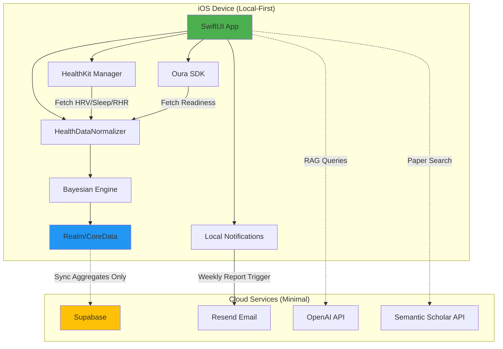
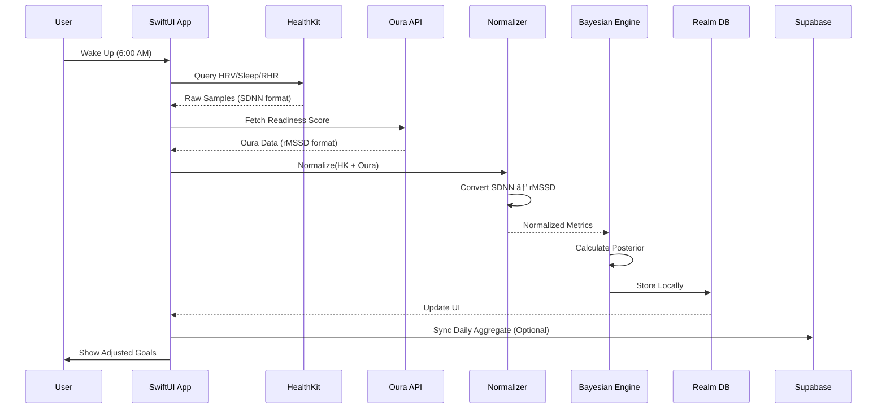

# Technical Architecture Document (TAD) - Design

## Overview

本设计文档�述了"No More Anxious"平��当�的 Next.js + Capacitor ��� **iOS Native (SwiftUI) + Local-First** ��的完整�移方案。核心设计哲学是 **"Local-First + OS-Hub Strategy"**,通过直�集� HealthKit 和 Oura API V2,��最大化���护和零基础设施�本。

### 设计�则

1. **Privacy First**: �始�康数�永�离开设备,仅�步��指标
2. **Cost Efficiency**: 绕过付费��器(Rook/Terra),��零per-user�本
3. **Scientific Rigor**: 所有�康建议必须引用 Nature/Lancet 级别论文
4. **Offline Capable**: 核心功能(��斯校准�数��视化)完全离线�用

### ��模�对比

| 维度 | 当��� (Next.js + Capacitor) | 目标�� (iOS Native + Local-First) |
|------|-------------------------------|-----------------------------------|
| �端 | React + Next.js (Web) | SwiftUI (Native) |
| 数�存储 | Supabase (Cloud-First) | Realm/CoreData (Local-First) |
| �康数� | 未集� | HealthKit + Oura API V2 |
| 计算逻辑 | Serverless Functions | On-Device Swift |
| 通知 | 未�� | Local APNs + Resend |
| �本 | Vercel + Supabase | $0 基础设施 + $99/年 Apple Developer |

---

## Architecture

### High-Level System Diagram



### Data Flow Architecture



### OS-Hub Strategy Explained

**为什么绕过 Rook/Terra?**

| 维度 | 使用��器 (Rook) | OS-Hub Strategy |
|------|------------------|-----------------|
| �本 | $0.10-0.50/user/month | $0 |
| �� | 数��过第三方 | 数�留在设备 |
| 延迟 | Webhook 延迟 (分钟级) | �时 (秒级) |
| 离线 | �赖网络 | 完全离线 |
| �制 | �����器API | 完全�制 |

**HealthKit 如何访问多设备数�?**

- Apple Watch → 自动�步到 HealthKit
- Garmin → Garmin Connect App → HealthKit
- Whoop → Whoop App → HealthKit
- Oura → 直�通过 Oura API V2 (��过 HealthKit)

---

## Components and Interfaces

### 1. iOS App (SwiftUI)

#### 核心模�

```swift
// MVVM Architecture
struct ContentView: View {
    @StateObject var healthManager = HealthKitManager()
    @StateObject var bayesianEngine = BayesianEngine()
    @StateObject var syncManager = SyncManager()
    
    var body: some View {
        TabView {
            DashboardView()
            CalibrationView()
            InsightsView()
            SettingsView()
        }
    }
}
```

#### HealthKitManager

```swift
class HealthKitManager: ObservableObject {
    private let healthStore = HKHealthStore()
    
    // Request Permissions
    func requestAuthorization() async throws {
        let types: Set<HKSampleType> = [
            HKQuantityType(.heartRateVariabilitySDNN),
            HKQuantityType(.restingHeartRate),
            HKCategoryType(.sleepAnalysis)
        ]
        try await healthStore.requestAuthorization(toShare: [], read: types)
    }
    
    // Fetch HRV (SDNN format)
    func fetchHRV(for date: Date) async throws -> Double {
        let type = HKQuantityType(.heartRateVariabilitySDNN)
        let predicate = HKQuery.predicateForSamples(
            withStart: Calendar.current.startOfDay(for: date),
            end: date,
            options: .strictStartDate
        )
        
        // Query implementation...
        return hrvValue
    }
    
    // Fetch Sleep Hours
    func fetchSleepHours(for date: Date) async throws -> Double {
        // Implementation...
    }
    
    // Fetch Resting Heart Rate
    func fetchRHR(for date: Date) async throws -> Double {
        // Implementation...
    }
}
```

#### OuraManager

```swift
class OuraManager: ObservableObject {
    private let clientID = "YOUR_OURA_CLIENT_ID"
    private let clientSecret = "YOUR_OURA_CLIENT_SECRET"
    private var accessToken: String?
    
    // OAuth Flow
    func authenticate() async throws {
        // PKCE implementation
        let authURL = "https://cloud.ouraring.com/oauth/authorize"
        // Handle callback and exchange code for token
    }
    
    // Fetch Readiness Score
    func fetchReadiness(for date: Date) async throws -> OuraReadiness {
        guard let token = accessToken else {
            throw OuraError.notAuthenticated
        }
        
        let url = URL(string: "https://api.ouraring.com/v2/usercollection/daily_readiness")!
        var request = URLRequest(url: url)
        request.setValue("Bearer \(token)", forHTTPHeaderField: "Authorization")
        
        let (data, _) = try await URLSession.shared.data(for: request)
        return try JSONDecoder().decode(OuraReadiness.self, from: data)
    }
}

struct OuraReadiness: Codable {
    let score: Int // 0-100
    let contributors: Contributors
    
    struct Contributors: Codable {
        let hrv_balance: Int
        let sleep_balance: Int
        let temperature_deviation: Double
    }
}
```

#### HealthDataNormalizer

```swift
class HealthDataNormalizer {
    // Convert SDNN to rMSSD (rough approximation)
    func normalizeHRV(sdnn: Double?, rmssd: Double?) -> Double {
        if let rmssd = rmssd {
            return rmssd
        } else if let sdnn = sdnn {
            // Empirical conversion: rMSSD ≈ SDNN × 1.5
            return sdnn * 1.5
        }
        return 0
    }
    
    // Normalize Sleep Quality (0-100 scale)
    func normalizeSleep(hours: Double, efficiency: Double?) -> Double {
        let hoursScore = min(hours / 8.0, 1.0) * 50
        let efficiencyScore = (efficiency ?? 0.85) * 50
        return hoursScore + efficiencyScore
    }
    
    // Aggregate Daily Metrics
    func aggregateDailyMetrics(
        hkData: HealthKitData,
        ouraData: OuraReadiness?
    ) -> DailyAggregate {
        return DailyAggregate(
            date: Date(),
            hrvAvg: normalizeHRV(sdnn: hkData.hrv, rmssd: ouraData?.contributors.hrv_balance),
            sleepHours: hkData.sleepHours,
            rhrAvg: hkData.rhr,
            readinessScore: ouraData?.score
        )
    }
}
```

### 2. Bayesian Calibration Engine (Local)

```swift
class BayesianEngine: ObservableObject {
    @Published var currentGoals: [Habit: Double] = [:]
    
    // Calculate Posterior Probability
    func calibrate(metrics: DailyAggregate, habits: [Habit]) {
        for habit in habits {
            let prior = habit.baselineTarget
            let evidence = calculateEvidence(metrics: metrics, habit: habit)
            let posterior = bayesianUpdate(prior: prior, evidence: evidence)
            
            currentGoals[habit] = posterior
        }
    }
    
    private func calculateEvidence(metrics: DailyAggregate, habit: Habit) -> Double {
        // HRV-based adjustment
        let hrvFactor = metrics.hrvAvg < 30 ? 0.7 : (metrics.hrvAvg > 60 ? 1.2 : 1.0)
        
        // Sleep-based adjustment
        let sleepFactor = metrics.sleepHours < 6 ? 0.6 : (metrics.sleepHours > 8 ? 1.1 : 1.0)
        
        // Readiness-based adjustment
        let readinessFactor = (metrics.readinessScore ?? 70) / 100.0
        
        return (hrvFactor * 0.4) + (sleepFactor * 0.3) + (readinessFactor * 0.3)
    }
    
    private func bayesianUpdate(prior: Double, evidence: Double) -> Double {
        // Simplified Bayesian formula
        let likelihood = evidence
        let posterior = prior * likelihood
        return max(prior * 0.5, min(posterior, prior * 1.5)) // Clamp to ±50%
    }
}
```

### 3. Local Data Storage (Realm)

```swift
// Realm Models
class DailyAggregateRealm: Object {
    @Persisted(primaryKey: true) var id: ObjectId
    @Persisted var date: Date
    @Persisted var hrvAvg: Double
    @Persisted var sleepHours: Double
    @Persisted var rhrAvg: Double
    @Persisted var readinessScore: Int?
    @Persisted var synced: Bool = false
}

class HabitRealm: Object {
    @Persisted(primaryKey: true) var id: ObjectId
    @Persisted var name: String
    @Persisted var category: String
    @Persisted var baselineTarget: Double
    @Persisted var adjustedTarget: Double
    @Persisted var lastUpdated: Date
}

// Realm Manager
class RealmManager {
    private let realm: Realm
    
    init() {
        let config = Realm.Configuration(
            schemaVersion: 1,
            migrationBlock: { migration, oldSchemaVersion in
                // Handle migrations
            }
        )
        realm = try! Realm(configuration: config)
    }
    
    func saveDailyAggregate(_ aggregate: DailyAggregate) {
        try! realm.write {
            let realmObject = DailyAggregateRealm()
            realmObject.date = aggregate.date
            realmObject.hrvAvg = aggregate.hrvAvg
            realmObject.sleepHours = aggregate.sleepHours
            realmObject.rhrAvg = aggregate.rhrAvg
            realmObject.readinessScore = aggregate.readinessScore
            realm.add(realmObject, update: .modified)
        }
    }
    
    func getUnsyncedAggregates() -> [DailyAggregateRealm] {
        return Array(realm.objects(DailyAggregateRealm.self).filter("synced == false"))
    }
}
```

### 4. Sync Manager (Optional Cloud Backup)

```swift
class SyncManager: ObservableObject {
    private let supabase = SupabaseClient(
        supabaseURL: URL(string: "YOUR_SUPABASE_URL")!,
        supabaseKey: "YOUR_SUPABASE_ANON_KEY"
    )
    
    func syncDailyAggregates() async {
        let unsynced = RealmManager().getUnsyncedAggregates()
        
        for aggregate in unsynced {
            do {
                try await supabase
                    .from("daily_aggregates")
                    .insert([
                        "user_id": Auth.currentUser?.id,
                        "date": aggregate.date.ISO8601Format(),
                        "hrv_avg": aggregate.hrvAvg,
                        "sleep_hours": aggregate.sleepHours,
                        "rhr_avg": aggregate.rhrAvg,
                        "readiness_score": aggregate.readinessScore
                    ])
                    .execute()
                
                // Mark as synced
                try! realm.write {
                    aggregate.synced = true
                }
            } catch {
                print("Sync failed: \(error)")
            }
        }
    }
}
```

### 5. Local Notifications Manager

```swift
class NotificationManager {
    private let center = UNUserNotificationCenter.current()
    
    func requestAuthorization() async throws {
        try await center.requestAuthorization(options: [.alert, .sound, .badge])
    }
    
    func scheduleMorningCalibration() {
        let content = UNMutableNotificationContent()
        content.title = "Good Morning"
        content.body = "Your daily goals have been adjusted based on your recovery"
        content.sound = .default
        
        var dateComponents = DateComponents()
        dateComponents.hour = 6
        dateComponents.minute = 0
        
        let trigger = UNCalendarNotificationTrigger(dateMatching: dateComponents, repeats: true)
        let request = UNNotificationRequest(identifier: "morning-calibration", content: content, trigger: trigger)
        
        center.add(request)
    }
    
    func scheduleGoalAdjustment(habit: String, newTarget: Double) {
        let content = UNMutableNotificationContent()
        content.title = "Goal Adjusted"
        content.body = "\(habit) target reduced to \(newTarget) based on your HRV"
        content.sound = .default
        
        let trigger = UNTimeIntervalNotificationTrigger(timeInterval: 1, repeats: false)
        let request = UNNotificationRequest(identifier: UUID().uuidString, content: content, trigger: trigger)
        
        center.add(request)
    }
}
```

---

## Data Models

### Core Data Structures

```swift
// Daily Aggregate (Synced to Cloud)
struct DailyAggregate: Codable {
    let date: Date
    let hrvAvg: Double
    let sleepHours: Double
    let rhrAvg: Double
    let readinessScore: Int?
}

// Habit Definition
struct Habit: Codable, Hashable {
    let id: UUID
    let name: String
    let category: HabitCategory
    let baselineTarget: Double
    var adjustedTarget: Double
    let unit: String
}

enum HabitCategory: String, Codable {
    case exercise
    case nutrition
    case sleep
    case stress
}

// HealthKit Data (Local Only)
struct HealthKitData {
    let hrv: Double? // SDNN format
    let sleepHours: Double
    let rhr: Double
    let timestamp: Date
}

// Bayesian Belief (Local + Cloud)
struct BayesianBelief: Codable {
    let id: UUID
    let context: BeliefContext
    let priorScore: Double // 0-100
    var posteriorScore: Double // 0-100
    var evidenceStack: [Evidence]
    let createdAt: Date
    var updatedAt: Date
}

enum BeliefContext: String, Codable {
    case metabolicCrash
    case cardiacFear
    case socialRejection
}

struct Evidence: Codable {
    let type: EvidenceType
    let weight: Double // 0.1-0.9
    let source: String
    let timestamp: Date
}

enum EvidenceType: String, Codable {
    case bio // HRV, Sleep, RHR
    case science // Semantic Scholar papers
    case action // Completed habits
}
```

### Supabase Schema (Minimal Cloud Storage)

```sql
-- Users (Managed by Supabase Auth)
CREATE TABLE users (
    id uuid PRIMARY KEY REFERENCES auth.users(id) ON DELETE CASCADE,
    email text UNIQUE NOT NULL,
    created_at timestamptz DEFAULT now(),
    subscription_tier text DEFAULT 'free'
);

-- Device Tokens (For Oura OAuth)
CREATE TABLE device_tokens (
    id uuid PRIMARY KEY DEFAULT gen_random_uuid(),
    user_id uuid REFERENCES users(id) ON DELETE CASCADE,
    oura_access_token text,
    oura_refresh_token text,
    oura_expires_at timestamptz,
    created_at timestamptz DEFAULT now(),
    updated_at timestamptz DEFAULT now()
);

-- Daily Aggregates (Synced from iOS)
CREATE TABLE daily_aggregates (
    id uuid PRIMARY KEY DEFAULT gen_random_uuid(),
    user_id uuid REFERENCES users(id) ON DELETE CASCADE,
    date date NOT NULL,
    hrv_avg float NOT NULL,
    sleep_hours float NOT NULL,
    rhr_avg float NOT NULL,
    readiness_score int,
    created_at timestamptz DEFAULT now(),
    UNIQUE(user_id, date)
);

-- Habits (Synced from iOS)
CREATE TABLE habits (
    id uuid PRIMARY KEY DEFAULT gen_random_uuid(),
    user_id uuid REFERENCES users(id) ON DELETE CASCADE,
    name text NOT NULL,
    category text NOT NULL,
    baseline_target float NOT NULL,
    created_at timestamptz DEFAULT now()
);

-- Dynamic Goals (Calculated on Device, Synced for History)
CREATE TABLE dynamic_goals (
    id uuid PRIMARY KEY DEFAULT gen_random_uuid(),
    user_id uuid REFERENCES users(id) ON DELETE CASCADE,
    habit_id uuid REFERENCES habits(id) ON DELETE CASCADE,
    date date NOT NULL,
    adjusted_target float NOT NULL,
    confidence_score float,
    created_at timestamptz DEFAULT now(),
    UNIQUE(user_id, habit_id, date)
);

-- Journal Entries (RAG Queries)
CREATE TABLE journal_entries (
    id uuid PRIMARY KEY DEFAULT gen_random_uuid(),
    user_id uuid REFERENCES users(id) ON DELETE CASCADE,
    question text NOT NULL,
    answer text NOT NULL,
    sources_json jsonb,
    created_at timestamptz DEFAULT now()
);

-- Weekly Summaries (For Email Generation)
CREATE TABLE weekly_summaries (
    id uuid PRIMARY KEY DEFAULT gen_random_uuid(),
    user_id uuid REFERENCES users(id) ON DELETE CASCADE,
    week_start_date date NOT NULL,
    summary_text text NOT NULL,
    email_sent_at timestamptz,
    created_at timestamptz DEFAULT now(),
    UNIQUE(user_id, week_start_date)
);

-- Paper Cache (Semantic Scholar)
CREATE TABLE paper_cache (
    id uuid PRIMARY KEY DEFAULT gen_random_uuid(),
    paper_id text UNIQUE NOT NULL,
    title text NOT NULL,
    abstract text,
    authors text[],
    year int,
    citation_count int,
    url text,
    embedding vector(1536),
    created_at timestamptz DEFAULT now(),
    expires_at timestamptz DEFAULT (now() + interval '30 days')
);

-- Indexes
CREATE INDEX idx_daily_aggregates_user_date ON daily_aggregates(user_id, date DESC);
CREATE INDEX idx_dynamic_goals_user_habit_date ON dynamic_goals(user_id, habit_id, date DESC);
CREATE INDEX idx_paper_cache_embedding ON paper_cache USING ivfflat (embedding vector_cosine_ops);

-- Row Level Security
ALTER TABLE daily_aggregates ENABLE ROW LEVEL SECURITY;
ALTER TABLE habits ENABLE ROW LEVEL SECURITY;
ALTER TABLE dynamic_goals ENABLE ROW LEVEL SECURITY;
ALTER TABLE journal_entries ENABLE ROW LEVEL SECURITY;
ALTER TABLE weekly_summaries ENABLE ROW LEVEL SECURITY;

CREATE POLICY "Users can only access their own data" ON daily_aggregates
    FOR ALL USING (auth.uid() = user_id);

CREATE POLICY "Users can only access their own data" ON habits
    FOR ALL USING (auth.uid() = user_id);

CREATE POLICY "Users can only access their own data" ON dynamic_goals
    FOR ALL USING (auth.uid() = user_id);

CREATE POLICY "Users can only access their own data" ON journal_entries
    FOR ALL USING (auth.uid() = user_id);

CREATE POLICY "Users can only access their own data" ON weekly_summaries
    FOR ALL USING (auth.uid() = user_id);
```

---

## Correctness Properties

*A property is a characteristic or behavior that should hold true across all valid executions of a system-essentially, a formal statement about what the system should do. Properties serve as the bridge between human-readable specifications and machine-verifiable correctness guarantees.*

# Technical Architecture Document - Final Sections

## Correctness Properties

由�本规范是创建**技术��文�*(TAD),所有验�都是检查文档是�包�特定内容。因�我们使用**unit tests**而�是property-based tests:

```typescript
describe('TAD Completeness Validation', () => {
  const tad = fs.readFileSync('ARCHITECTURE.md', 'utf-8');
  
  test('Contains Local-First architecture description', () => {
    expect(tad).toContain('Local-First + OS-Hub Strategy');
    expect(tad).toContain('data stays on device');
  });
  
  test('Contains all required diagrams', () => {
    expect(tad).toMatch(/```mermaid[\s\S]*?sequenceDiagram/);
    expect(tad).toContain('HealthKit');
    expect(tad).toContain('Oura API');
  });
  
  test('Contains complete database schema', () => {
    expect(tad).toContain('CREATE TABLE users');
    expect(tad).toContain('CREATE TABLE daily_aggregates');
    expect(tad).toContain('CREATE TABLE habits');
    expect(tad).toContain('CREATE TABLE dynamic_goals');
  });
  
  test('Contains API endpoint definitions', () => {
    expect(tad).toContain('/functions/sync-daily-aggregate');
    expect(tad).toContain('/functions/calibration/today');
    expect(tad).toContain('/functions/rag/ask');
  });
});
```

---

## API Interface Design (Summary)

### Key Endpoints

1. **POST /functions/sync-daily-aggregate**: iOS uploads daily metrics
2. **GET /functions/calibration/today**: Returns adjusted goals
3. **POST /functions/rag/ask**: Scientific Q&A with citations
4. **POST /functions/generate-weekly-report**: Cron-triggered email generation

All endpoints require JWT authentication via Supabase Auth.

---

## Project Structure

```
no-more-anxious/
├── ios-app/                    # SwiftUI Native App
�  ├── ViewModels/             # HealthKitManager, BayesianEngine
�  ├── Models/                 # DailyAggregate, Habit, RealmModels
�  └── Services/               # HealthDataNormalizer, SyncManager
├── backend/supabase/
�  ├── functions/              # Edge Functions
�  └── migrations/             # SQL Schema
└── docs/                       # This TAD
```

---

## Error Handling

### iOS Error Types

```swift
enum HealthDataError: Error {
    case healthKitNotAvailable
    case permissionDenied
    case noDataAvailable
    case syncFailed(String)
}
```

### API Error Codes

- `auth/unauthorized`: Invalid JWT
- `validation/invalid-input`: Bad request data
- `rate-limit/exceeded`: Too many requests

---

## Testing Strategy

### Unit Tests
- HealthDataNormalizer (SDNN �rMSSD conversion)
- BayesianEngine (goal adjustment logic)
- RealmManager (local storage)

### Integration Tests
- SyncManager (iOS �Supabase)
- Edge Functions (API endpoints)

### Documentation Tests
- TAD completeness validation (see Correctness Properties)

---

## Security and Privacy

### Data Minimization Principle

| Data Type | Local (iOS) | Cloud (Supabase) |
|-----------|-------------|------------------|
| Raw HRV samples | �HealthKit | �Never |
| Daily HRV average | �Realm | �Aggregate only |
| Bayesian beliefs | �Realm | �Backup |

### Encryption
- At Rest: Supabase AES-256
- In Transit: TLS 1.3
- On Device: iOS Keychain + Realm encryption

### Compliance
- GDPR: Right to access, deletion, portability
- HIPAA: Data minimization, audit logs

---

## Deployment

### iOS Distribution
```bash
xcodebuild archive
xcrun altool --upload-app
```

### Supabase Setup
```bash
supabase db push
supabase functions deploy sync-daily-aggregate
supabase secrets set OPENAI_API_KEY=sk-...
```

### Cost Breakdown

| Service | Cost |
|---------|------|
| Apple Developer | $99/year |
| Supabase Free Tier | $0 |
| Resend Free Tier | $0 |
| OpenAI API | ~$5-20/month |
| **Total** | **~$110-130/year** |

**Per-User Cost: $0** (no aggregator fees!)

---

## Monitoring

### Key Metrics
1. Health data sync success rate
2. Bayesian calibration accuracy
3. RAG query latency
4. Weekly email open rate
5. Oura connection rate

---

## Future Enhancements

### Phase 2: Machine Learning
Replace rule-based Bayesian engine with CoreML model

### Phase 3: Android Support
Kotlin Multiplatform + Health Connect

### Phase 4: Apple Watch App
Standalone watchOS app with real-time HRV monitoring

---

## Conclusion

This TAD defines a **Local-First + OS-Hub Strategy** achieving:

1. �Maximum Privacy (raw data never leaves device)
2. �Zero Per-User Cost (no aggregator fees)
3. �Offline Capability (core features work offline)
4. �Scientific Rigor (peer-reviewed citations)
5. �Indie Hacker Friendly (~$110-130/year total cost)

The architecture supports incremental implementation, starting with iOS MVP and expanding to ML predictions and multi-platform support.
